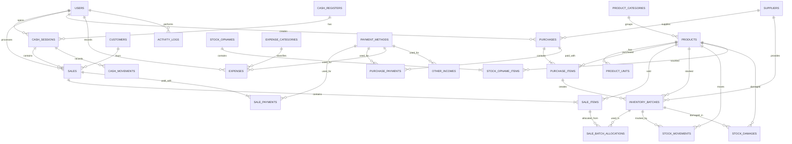

# Skema Database — Telur Jagoan

Dokumen ini berisi rancangan skema database lengkap untuk sistem Telur Jagoan: daftar tabel per domain, detail kolom tiap tabel, tabel yang sengaja tidak dibuat (beserta alasannya), relasi antar tabel, diagram ERD (Mermaid), daftar enum, dan format penomoran otomatis.

Skema ini dirancang untuk PostgreSQL menggunakan Prisma ORM (lihat `docs/ARCHITECTURE.md`).

---

## Revisi Model Data (2026-08-10)

Schema yang sudah ada tetap menjadi kontrak database. `suppliers` dipertahankan untuk referensi internal, tetapi supplier pada transaksi pembelian wajib dapat diketik langsung. `customers` dipertahankan untuk record internal (termasuk Pelanggan Umum), tanpa menu CRUD navigasi. Pembatalan/retur penjualan dan pembelian harus memakai transaksi Prisma yang memperbarui stok, pergerakan stok, dan tabel keuangan secara konsisten. Harga/kg disimpan statis pada produk/transaksi pembelian, dan pembayaran pembelian menyimpan bukti pembayaran serta status hutang/pengingat jatuh tempo.

Implementasi konsolidasi menu Penjualan menambahkan kontrak Prisma untuk `sales`, `sale_items`, `sale_payments`, `sale_batch_allocations`, `sale_returns`, dan `sale_return_items`. Aksi pembatalan/retur memakai `stock_movements` bertipe `SALE_RETURN` dengan `reference_type` berbeda (`SALE_CANCEL` atau `SALE_RETURN`) dan `cash_movements` bertipe `REFUND_CASH` agar stok dan kas tetap sinkron.

Implementasi konsolidasi menu Pembelian/Kulakan menambahkan `purchases.supplier_name` sebagai snapshot nama supplier yang diketik pada transaksi, serta `purchase_payments.receipt_url` untuk bukti pembayaran. `purchase_returns`, `purchase_return_items`, dan `notifications` kini masuk kontrak Prisma aktual. Notifikasi jatuh tempo hutang supplier dibuat on-demand saat dashboard Owner dirender untuk H-7/H-3/H-1/H dan menghindari duplikasi per hari berdasarkan `reference_id`.

Menu Supplier tidak tersedia di navigasi maupun sebagai halaman CRUD terpisah. Riwayat pembelian dan sisa hutang per supplier dilihat dari halaman Pembelian melalui filter `purchases.supplier_name`, sementara tabel `suppliers` tetap dipakai internal oleh mekanisme upsert-by-name saat pembelian dibuat.

Implementasi penyederhanaan Produk menetapkan UI produk berbasis kilogram. Form produk hanya menerima kode, nama, kategori, gambar, harga per kg, dan deskripsi. Tabel `product_units` tetap dipakai di belakang layar dengan satu baris otomatis per produk: `unit_name = 'Kg'`, `conversion_to_base = 1`, `is_base_unit = true`, dan `selling_price` sama dengan harga per kg. `products.current_stock` tidak diisi manual dari form produk dan hanya berubah melalui pembelian, penjualan/retur, retur pembelian, stok opname, atau kerusakan. Kerusakan stok dicatat di `stock_damages` dan `stock_movements` bertipe `DAMAGE`.

Implementasi revisi Keuangan membatasi navigasi ke tiga halaman: semua transaksi keuangan, pemasukan, dan pengeluaran. `expenses` dan `other_incomes` memakai soft-delete melalui `deleted_at`. Jika baris terkait memiliki `cash_movement_id`, edit dan hapus wajib mengoreksi atau menghapus `cash_movements` dalam satu transaksi Prisma, serta mencatat `activity_logs`.

Sinkronisasi akhir revisi dicatat juga dalam `database/schema.sql`. Artefak SQL tersebut memuat perubahan kolom lintas revisi yang wajib ada di database aktual: `purchases.supplier_name`, `purchase_payments.receipt_url`, `expenses.deleted_at`, `other_incomes.deleted_at`, dan relasi opsional `cash_movement_id` untuk rekonsiliasi kas modul keuangan.

## 1. Susunan Database

### Pengguna dan Toko

```text
users
store_settings
cash_registers
cash_sessions
cash_movements
activity_logs
notifications
```

### Master Data

```text
suppliers
customers
product_categories
products
product_units
payment_methods
```

### Pembelian

```text
purchases
purchase_items
purchase_payments
purchase_returns
purchase_return_items
```

### Penjualan

```text
sales
sale_items
sale_payments
sale_batch_allocations
sale_returns
sale_return_items
```

### Stok

```text
inventory_batches
stock_movements
stock_opnames
stock_opname_items
stock_damages
```

### Keuangan

```text
expense_categories
expenses
other_incomes
```

### Landing Page

```text
landing_banners
landing_features
store_social_media
```

---

## 2. Detail Tabel Database

### 21.1 `users`

| Kolom | Tipe | Keterangan |
|---|---|---|
| `id` | UUID | Primary key |
| `name` | VARCHAR | Nama pengguna |
| `username` | VARCHAR | Username unik |
| `email` | VARCHAR | Email unik |
| `password_hash` | TEXT | Password hash |
| `role` | ENUM | `OWNER` atau `CASHIER` |
| `phone` | VARCHAR | Nomor telepon |
| `is_active` | BOOLEAN | Status akun |
| `last_login_at` | TIMESTAMP | Login terakhir |
| `created_at` | TIMESTAMP | Waktu dibuat |
| `updated_at` | TIMESTAMP | Waktu diperbarui |

### 21.2 `store_settings`

Tabel ini dipakai oleh menu Pengaturan Struk. Profil toko tidak menjadi menu terpisah; logo, nama toko, alamat, nomor telepon/WhatsApp, dan footer struk dikelola dari halaman ini.

| Kolom | Tipe | Keterangan |
|---|---|---|
| `id` | UUID | Primary key |
| `store_name` | VARCHAR | Nama toko |
| `tagline` | VARCHAR | Slogan |
| `address` | TEXT | Alamat |
| `phone` | VARCHAR | Telepon |
| `whatsapp` | VARCHAR | WhatsApp |
| `email` | VARCHAR | Email |
| `logo_url` | TEXT | URL logo |
| `receipt_footer` | TEXT | Footer struk |
| `tax_percentage` | DECIMAL | Pajak |
| `currency` | VARCHAR | Mata uang |
| `timezone` | VARCHAR | Zona waktu |
| `created_at` | TIMESTAMP | Waktu dibuat |
| `updated_at` | TIMESTAMP | Waktu diperbarui |

### 21.3 `cash_registers`

| Kolom | Tipe | Keterangan |
|---|---|---|
| `id` | UUID | Primary key |
| `code` | VARCHAR | Kode kasir |
| `name` | VARCHAR | Nama perangkat |
| `location` | VARCHAR | Lokasi |
| `is_active` | BOOLEAN | Status |
| `created_at` | TIMESTAMP | Waktu dibuat |
| `updated_at` | TIMESTAMP | Waktu diperbarui |

### 21.4 `cash_sessions`

| Kolom | Tipe | Keterangan |
|---|---|---|
| `id` | UUID | Primary key |
| `session_number` | VARCHAR | Nomor sesi |
| `cash_register_id` | UUID | Relasi perangkat kasir |
| `cashier_id` | UUID | Relasi kasir |
| `opened_at` | TIMESTAMP | Waktu buka |
| `opening_cash` | DECIMAL | Modal awal |
| `closed_at` | TIMESTAMP | Waktu tutup |
| `expected_cash` | DECIMAL | Kas seharusnya |
| `actual_cash` | DECIMAL | Kas fisik |
| `cash_difference` | DECIMAL | Selisih |
| `status` | ENUM | `OPEN`/`CLOSED` |
| `notes` | TEXT | Catatan |
| `created_at` | TIMESTAMP | Waktu dibuat |
| `updated_at` | TIMESTAMP | Waktu diperbarui |

### 21.5 `cash_movements`

| Kolom | Tipe | Keterangan |
|---|---|---|
| `id` | UUID | Primary key |
| `cash_session_id` | UUID | Relasi sesi |
| `movement_type` | ENUM | Jenis pergerakan |
| `amount` | DECIMAL | Jumlah |
| `description` | TEXT | Keterangan |
| `reference_type` | VARCHAR | Jenis referensi |
| `reference_id` | UUID | ID referensi |
| `created_by` | UUID | Pengguna |
| `created_at` | TIMESTAMP | Waktu dibuat |

Jenis pergerakan:

```text
OPENING_CASH
CASH_IN
CASH_OUT
SALE_CASH
REFUND_CASH
CLOSING_ADJUSTMENT
```

### 21.6 `suppliers`

Tabel ini dipertahankan sebagai master internal. Tidak ada menu CRUD Supplier terpisah; pembuatan/perubahan record terjadi otomatis dari input nama supplier di form pembelian.

| Kolom | Tipe | Keterangan |
|---|---|---|
| `id` | UUID | Primary key |
| `supplier_code` | VARCHAR | Kode unik |
| `name` | VARCHAR | Nama supplier |
| `contact_person` | VARCHAR | Nama kontak |
| `phone` | VARCHAR | Telepon |
| `email` | VARCHAR | Email |
| `address` | TEXT | Alamat |
| `notes` | TEXT | Catatan |
| `is_active` | BOOLEAN | Status |
| `created_at` | TIMESTAMP | Waktu dibuat |
| `updated_at` | TIMESTAMP | Waktu diperbarui |

### 21.7 `customers`

Tabel ini dipertahankan hanya untuk record internal `Pelanggan Umum` (`CUS-0000`) yang dibuat oleh seed. Tidak ada menu CRUD Pelanggan dan transaksi penjualan otomatis memakai record ini sebagai `sales.customer_id`.

| Kolom | Tipe | Keterangan |
|---|---|---|
| `id` | UUID | Primary key |
| `customer_code` | VARCHAR | Kode pelanggan |
| `name` | VARCHAR | Nama |
| `phone` | VARCHAR | Telepon |
| `address` | TEXT | Alamat |
| `customer_type` | ENUM | Jenis pelanggan |
| `is_active` | BOOLEAN | Status |
| `created_at` | TIMESTAMP | Waktu dibuat |
| `updated_at` | TIMESTAMP | Waktu diperbarui |

Jenis pelanggan:

```text
GENERAL
RETAIL
WHOLESALE
```

Data default:

```text
Kode  : CUS-0000
Nama  : Pelanggan Umum
Jenis : GENERAL
```

Tidak ada kolom kredit, hutang, cicilan, atau jatuh tempo pelanggan.

### 21.8 `product_categories`

| Kolom | Tipe | Keterangan |
|---|---|---|
| `id` | UUID | Primary key |
| `category_code` | VARCHAR | Kode kategori |
| `name` | VARCHAR | Nama |
| `description` | TEXT | Deskripsi |
| `is_active` | BOOLEAN | Status |
| `created_at` | TIMESTAMP | Waktu dibuat |
| `updated_at` | TIMESTAMP | Waktu diperbarui |

### 21.9 `products`

| Kolom | Tipe | Keterangan |
|---|---|---|
| `id` | UUID | Primary key |
| `product_code` | VARCHAR | Kode produk |
| `barcode` | VARCHAR | Barcode internal/opsional; tidak ditampilkan di form sederhana |
| `category_id` | UUID | Relasi kategori |
| `name` | VARCHAR | Nama produk |
| `description` | TEXT | Deskripsi |
| `image_url` | TEXT | Gambar |
| `base_unit_name` | VARCHAR | Satuan dasar internal; untuk UI sederhana diset otomatis `Kg` |
| `minimum_stock` | DECIMAL | Stok minimum internal; tidak diisi di form sederhana |
| `current_stock` | DECIMAL | Stok saat ini; mulai 0 dan tidak boleh diedit manual dari form produk |
| `is_featured` | BOOLEAN | Produk unggulan internal |
| `is_active` | BOOLEAN | Status |
| `created_at` | TIMESTAMP | Waktu dibuat |
| `updated_at` | TIMESTAMP | Waktu diperbarui |

### 21.10 `product_units`

| Kolom | Tipe | Keterangan |
|---|---|---|
| `id` | UUID | Primary key |
| `product_id` | UUID | Relasi produk |
| `unit_name` | VARCHAR | Nama satuan |
| `conversion_to_base` | DECIMAL | Konversi |
| `selling_price` | DECIMAL | Harga jual |
| `wholesale_price` | DECIMAL | Harga grosir |
| `barcode` | VARCHAR | Barcode satuan |
| `is_base_unit` | BOOLEAN | Satuan dasar |
| `is_active` | BOOLEAN | Status |
| `created_at` | TIMESTAMP | Waktu dibuat |
| `updated_at` | TIMESTAMP | Waktu diperbarui |

Aturan UI sederhana:

```text
Untuk setiap produk, sistem otomatis menjaga satu baris product_units:
unit_name          = Kg
conversion_to_base = 1
is_base_unit       = true
selling_price      = harga per kg dari form produk
```

### 21.11 `payment_methods`

| Kolom | Tipe | Keterangan |
|---|---|---|
| `id` | UUID | Primary key |
| `code` | VARCHAR | Kode |
| `name` | VARCHAR | Nama metode |
| `type` | ENUM | Jenis pembayaran |
| `is_active` | BOOLEAN | Status |
| `created_at` | TIMESTAMP | Waktu dibuat |
| `updated_at` | TIMESTAMP | Waktu diperbarui |

Jenis:

```text
CASH
QRIS
TRANSFER
DEBIT_CARD
OTHER
```

### 21.12 `purchases`

| Kolom | Tipe | Keterangan |
|---|---|---|
| `id` | UUID | Primary key |
| `purchase_number` | VARCHAR | Nomor pembelian |
| `supplier_id` | UUID | Relasi supplier |
| `supplier_name` | VARCHAR | Snapshot nama supplier persis seperti diketik pada transaksi |
| `supplier_invoice_number` | VARCHAR | Nota supplier |
| `purchase_date` | DATE | Tanggal pembelian |
| `due_date` | DATE | Jatuh tempo |
| `subtotal` | DECIMAL | Subtotal |
| `discount_amount` | DECIMAL | Diskon |
| `shipping_cost` | DECIMAL | Ongkir |
| `other_cost` | DECIMAL | Biaya lain |
| `grand_total` | DECIMAL | Total |
| `amount_paid` | DECIMAL | Total dibayar |
| `remaining_debt` | DECIMAL | Sisa hutang |
| `payment_status` | ENUM | Status pembayaran |
| `status` | ENUM | Status pembelian |
| `notes` | TEXT | Catatan |
| `created_by` | UUID | Owner pembuat |
| `created_at` | TIMESTAMP | Waktu dibuat |
| `updated_at` | TIMESTAMP | Waktu diperbarui |

### 21.13 `purchase_items`

| Kolom | Tipe | Keterangan |
|---|---|---|
| `id` | UUID | Primary key |
| `purchase_id` | UUID | Relasi pembelian |
| `product_id` | UUID | Produk |
| `product_unit_id` | UUID | Satuan |
| `quantity` | DECIMAL | Jumlah satuan |
| `conversion_to_base` | DECIMAL | Konversi |
| `base_quantity` | DECIMAL | Jumlah dasar |
| `unit_cost` | DECIMAL | Harga per satuan |
| `base_unit_cost` | DECIMAL | Modal satuan dasar |
| `discount_amount` | DECIMAL | Diskon |
| `subtotal` | DECIMAL | Subtotal |
| `expiry_date` | DATE | Kedaluwarsa |
| `created_at` | TIMESTAMP | Waktu dibuat |

### 21.14 `purchase_payments`

| Kolom | Tipe | Keterangan |
|---|---|---|
| `id` | UUID | Primary key |
| `payment_number` | VARCHAR | Nomor pembayaran |
| `purchase_id` | UUID | Relasi pembelian |
| `payment_method_id` | UUID | Metode |
| `payment_date` | DATE | Tanggal |
| `amount` | DECIMAL | Jumlah |
| `reference_number` | VARCHAR | Nomor referensi |
| `receipt_url` | TEXT | URL bukti pembayaran supplier (gambar/PDF) |
| `notes` | TEXT | Catatan |
| `created_by` | UUID | Owner |
| `created_at` | TIMESTAMP | Waktu dibuat |

### 21.15 `inventory_batches`

| Kolom | Tipe | Keterangan |
|---|---|---|
| `id` | UUID | Primary key |
| `batch_number` | VARCHAR | Nomor batch |
| `product_id` | UUID | Produk |
| `purchase_item_id` | UUID | Asal pembelian |
| `supplier_id` | UUID | Supplier |
| `received_date` | DATE | Tanggal diterima |
| `expiry_date` | DATE | Kedaluwarsa |
| `initial_quantity` | DECIMAL | Jumlah awal |
| `remaining_quantity` | DECIMAL | Sisa stok |
| `base_unit_cost` | DECIMAL | Harga modal |
| `status` | ENUM | Status batch |
| `created_at` | TIMESTAMP | Waktu dibuat |
| `updated_at` | TIMESTAMP | Waktu diperbarui |

### 21.16 `sales`

| Kolom | Tipe | Keterangan |
|---|---|---|
| `id` | UUID | Primary key |
| `sale_number` | VARCHAR | Nomor penjualan |
| `sale_date` | TIMESTAMP | Tanggal transaksi |
| `customer_id` | UUID | Pelanggan |
| `cashier_id` | UUID | Kasir |
| `cash_session_id` | UUID | Sesi kasir |
| `subtotal` | DECIMAL | Subtotal |
| `discount_amount` | DECIMAL | Diskon |
| `tax_amount` | DECIMAL | Pajak |
| `grand_total` | DECIMAL | Total |
| `amount_paid` | DECIMAL | Dibayar |
| `change_amount` | DECIMAL | Kembalian |
| `total_cost` | DECIMAL | Total HPP |
| `gross_profit` | DECIMAL | Laba kotor |
| `status` | ENUM | Status transaksi |
| `print_count` | INTEGER | Jumlah struk dicetak/dicetak ulang |
| `last_printed_at` | TIMESTAMP | Waktu terakhir struk dicetak |
| `notes` | TEXT | Catatan |
| `created_at` | TIMESTAMP | Waktu dibuat |
| `updated_at` | TIMESTAMP | Waktu diperbarui |

Status:

```text
COMPLETED
CANCELLED
REFUNDED
```

### 21.17 `sale_items`

| Kolom | Tipe | Keterangan |
|---|---|---|
| `id` | UUID | Primary key |
| `sale_id` | UUID | Relasi penjualan |
| `product_id` | UUID | Produk |
| `product_unit_id` | UUID | Satuan |
| `product_name_snapshot` | VARCHAR | Nama saat transaksi |
| `unit_name_snapshot` | VARCHAR | Satuan saat transaksi |
| `quantity` | DECIMAL | Jumlah |
| `conversion_to_base` | DECIMAL | Konversi |
| `base_quantity` | DECIMAL | Jumlah dasar |
| `unit_price` | DECIMAL | Harga jual |
| `discount_amount` | DECIMAL | Diskon |
| `subtotal` | DECIMAL | Subtotal |
| `cost_amount` | DECIMAL | HPP item |
| `profit_amount` | DECIMAL | Laba item |
| `created_at` | TIMESTAMP | Waktu dibuat |

### 21.18 `sale_payments`

| Kolom | Tipe | Keterangan |
|---|---|---|
| `id` | UUID | Primary key |
| `sale_id` | UUID | Relasi penjualan |
| `payment_method_id` | UUID | Metode pembayaran |
| `amount` | DECIMAL | Jumlah |
| `reference_number` | VARCHAR | Nomor referensi |
| `paid_at` | TIMESTAMP | Waktu bayar |
| `created_by` | UUID | Pengguna |
| `created_at` | TIMESTAMP | Waktu dibuat |

### 21.19 `sale_batch_allocations`

| Kolom | Tipe | Keterangan |
|---|---|---|
| `id` | UUID | Primary key |
| `sale_item_id` | UUID | Item penjualan |
| `inventory_batch_id` | UUID | Batch |
| `quantity` | DECIMAL | Jumlah diambil |
| `unit_cost` | DECIMAL | Harga modal |
| `total_cost` | DECIMAL | Total HPP |
| `created_at` | TIMESTAMP | Waktu dibuat |

### 21.20 `stock_movements`

| Kolom | Tipe | Keterangan |
|---|---|---|
| `id` | UUID | Primary key |
| `movement_number` | VARCHAR | Nomor pergerakan |
| `product_id` | UUID | Produk |
| `inventory_batch_id` | UUID | Batch |
| `movement_type` | ENUM | Jenis pergerakan |
| `quantity_in` | DECIMAL | Stok masuk |
| `quantity_out` | DECIMAL | Stok keluar |
| `stock_before` | DECIMAL | Stok sebelum |
| `stock_after` | DECIMAL | Stok sesudah |
| `reference_type` | VARCHAR | Jenis sumber |
| `reference_id` | UUID | ID sumber |
| `description` | TEXT | Keterangan |
| `created_by` | UUID | Pengguna |
| `created_at` | TIMESTAMP | Waktu dibuat |

Jenis:

```text
PURCHASE
SALE
SALE_RETURN
PURCHASE_RETURN
DAMAGE
EXPIRED
OPNAME_IN
OPNAME_OUT
ADJUSTMENT_IN
ADJUSTMENT_OUT
```

### 21.21 `stock_damages`

| Kolom | Tipe | Keterangan |
|---|---|---|
| `id` | UUID | Primary key |
| `damage_number` | VARCHAR | Nomor kerusakan |
| `product_id` | UUID | Produk |
| `inventory_batch_id` | UUID | Batch |
| `damage_date` | DATE | Tanggal |
| `damage_type` | ENUM | Jenis kerusakan |
| `quantity` | DECIMAL | Jumlah |
| `unit_cost` | DECIMAL | Harga modal |
| `loss_amount` | DECIMAL | Kerugian |
| `notes` | TEXT | Catatan |
| `created_by` | UUID | Owner |
| `created_at` | TIMESTAMP | Waktu dibuat |

Jenis:

```text
BROKEN
ROTTEN
EXPIRED
LOST
OTHER
```

### 21.22 `stock_opnames`

| Kolom | Tipe | Keterangan |
|---|---|---|
| `id` | UUID | Primary key |
| `opname_number` | VARCHAR | Nomor opname |
| `opname_date` | DATE | Tanggal |
| `status` | ENUM | Status |
| `notes` | TEXT | Catatan |
| `created_by` | UUID | Owner |
| `completed_at` | TIMESTAMP | Waktu selesai |
| `created_at` | TIMESTAMP | Waktu dibuat |
| `updated_at` | TIMESTAMP | Waktu diperbarui |

### 21.23 `stock_opname_items`

| Kolom | Tipe | Keterangan |
|---|---|---|
| `id` | UUID | Primary key |
| `stock_opname_id` | UUID | Relasi opname |
| `product_id` | UUID | Produk |
| `system_quantity` | DECIMAL | Stok sistem |
| `physical_quantity` | DECIMAL | Stok fisik |
| `difference_quantity` | DECIMAL | Selisih |
| `unit_cost` | DECIMAL | Harga modal |
| `difference_value` | DECIMAL | Nilai selisih |
| `notes` | TEXT | Catatan |
| `created_at` | TIMESTAMP | Waktu dibuat |

### 21.24 `expense_categories`

| Kolom | Tipe | Keterangan |
|---|---|---|
| `id` | UUID | Primary key |
| `code` | VARCHAR | Kode |
| `name` | VARCHAR | Nama kategori |
| `description` | TEXT | Deskripsi |
| `is_active` | BOOLEAN | Status |
| `created_at` | TIMESTAMP | Waktu dibuat |
| `updated_at` | TIMESTAMP | Waktu diperbarui |

### 21.25 `expenses`

| Kolom | Tipe | Keterangan |
|---|---|---|
| `id` | UUID | Primary key |
| `expense_number` | VARCHAR | Nomor pengeluaran |
| `expense_category_id` | UUID | Kategori |
| `expense_date` | DATE | Tanggal |
| `amount` | DECIMAL | Jumlah |
| `payment_method_id` | UUID | Metode |
| `description` | TEXT | Keterangan |
| `receipt_url` | TEXT | Bukti |
| `cash_movement_id` | UUID | Relasi opsional ke `cash_movements` |
| `created_by` | UUID | Owner |
| `deleted_at` | TIMESTAMP | Waktu soft-delete |
| `created_at` | TIMESTAMP | Waktu dibuat |
| `updated_at` | TIMESTAMP | Waktu diperbarui |

### 21.26 `other_incomes`

| Kolom | Tipe | Keterangan |
|---|---|---|
| `id` | UUID | Primary key |
| `income_number` | VARCHAR | Nomor pemasukan |
| `income_date` | DATE | Tanggal |
| `income_type` | VARCHAR | Jenis |
| `amount` | DECIMAL | Jumlah |
| `payment_method_id` | UUID | Metode |
| `description` | TEXT | Keterangan |
| `cash_movement_id` | UUID | Relasi opsional ke `cash_movements` |
| `created_by` | UUID | Owner |
| `deleted_at` | TIMESTAMP | Waktu soft-delete |
| `created_at` | TIMESTAMP | Waktu dibuat |
| `updated_at` | TIMESTAMP | Waktu diperbarui |

### 21.27 `activity_logs`

| Kolom | Tipe | Keterangan |
|---|---|---|
| `id` | UUID | Primary key |
| `user_id` | UUID | Pengguna |
| `action` | VARCHAR | Aksi |
| `entity_type` | VARCHAR | Jenis data |
| `entity_id` | UUID | ID data |
| `old_values` | JSON | Data lama |
| `new_values` | JSON | Data baru |
| `ip_address` | VARCHAR | IP |
| `user_agent` | TEXT | Perangkat |
| `created_at` | TIMESTAMP | Waktu dibuat |

### 21.28 `purchase_returns`

Retur barang ke supplier (misalnya telur pecah/rusak saat diterima, atau salah kirim).

| Kolom | Tipe | Keterangan |
|---|---|---|
| `id` | UUID | Primary key |
| `return_number` | VARCHAR | Nomor retur |
| `purchase_id` | UUID | Relasi pembelian asal |
| `supplier_id` | UUID | Relasi supplier |
| `return_date` | DATE | Tanggal retur |
| `reason` | ENUM | Alasan retur |
| `total_amount` | DECIMAL | Total nilai retur |
| `refund_method` | ENUM | Cara pengembalian dana |
| `status` | ENUM | Status retur |
| `notes` | TEXT | Catatan |
| `created_by` | UUID | Owner pembuat |
| `created_at` | TIMESTAMP | Waktu dibuat |
| `updated_at` | TIMESTAMP | Waktu diperbarui |

Alasan retur:

```text
DAMAGED
WRONG_ITEM
EXPIRED
OTHER
```

Cara pengembalian dana:

```text
CASH_REFUND
DEDUCT_FROM_DEBT
SUPPLIER_CREDIT
```

Status:

```text
DRAFT
COMPLETED
CANCELLED
```

Efek retur pembelian ke sistem:

- Stok pada batch terkait dikurangi (pergerakan stok `PURCHASE_RETURN`).
- Jika pembelian asal masih berstatus `UNPAID`/`PARTIAL`, `remaining_debt` pada `purchases` dapat dikurangi sejumlah nilai retur (opsi `DEDUCT_FROM_DEBT`).
- Jika pembelian sudah lunas, dana dikembalikan tunai (`CASH_REFUND`) dan tercatat sebagai pemasukan lain, atau dijadikan kredit untuk pembelian berikutnya (`SUPPLIER_CREDIT`).

### 21.29 `purchase_return_items`

| Kolom | Tipe | Keterangan |
|---|---|---|
| `id` | UUID | Primary key |
| `purchase_return_id` | UUID | Relasi retur pembelian |
| `purchase_item_id` | UUID | Item pembelian asal |
| `inventory_batch_id` | UUID | Batch terkait |
| `product_id` | UUID | Produk |
| `quantity` | DECIMAL | Jumlah diretur (satuan dasar) |
| `unit_cost` | DECIMAL | Harga modal saat pembelian |
| `subtotal` | DECIMAL | Total nilai item retur |
| `created_at` | TIMESTAMP | Waktu dibuat |

### 21.30 `sale_returns`

Retur dari pelanggan (jarang terjadi untuk produk telur karena sifatnya cepat rusak, namun tetap disediakan untuk kasus salah jual/kemasan rusak sesaat setelah dibeli).

| Kolom | Tipe | Keterangan |
|---|---|---|
| `id` | UUID | Primary key |
| `return_number` | VARCHAR | Nomor retur |
| `sale_id` | UUID | Relasi penjualan asal |
| `return_date` | DATE | Tanggal retur |
| `reason` | ENUM | Alasan retur |
| `total_amount` | DECIMAL | Total nilai retur |
| `refund_method` | ENUM | Cara pengembalian dana ke pelanggan |
| `status` | ENUM | Status retur |
| `approved_by` | UUID | Owner yang menyetujui |
| `notes` | TEXT | Catatan |
| `created_by` | UUID | Kasir/Owner pembuat |
| `created_at` | TIMESTAMP | Waktu dibuat |
| `updated_at` | TIMESTAMP | Waktu diperbarui |

Alasan retur:

```text
DAMAGED
WRONG_ITEM
CUSTOMER_CHANGED_MIND
OTHER
```

Cara pengembalian dana:

```text
CASH_REFUND
```

Status:

```text
DRAFT
COMPLETED
CANCELLED
```

Aturan:

- Retur penjualan **wajib disetujui owner** (`approved_by` terisi) karena berpengaruh langsung terhadap kas dan laba yang sudah tercatat.
- Retur hanya dapat dilakukan terhadap transaksi berstatus `COMPLETED` dan dalam rentang waktu wajar (disarankan maksimal di hari yang sama, mengingat sifat telur).
- Dana dikembalikan tunai langsung ke pelanggan (tidak ada metode lain karena tidak ada akun pelanggan tersimpan).

### 21.31 `sale_return_items`

| Kolom | Tipe | Keterangan |
|---|---|---|
| `id` | UUID | Primary key |
| `sale_return_id` | UUID | Relasi retur penjualan |
| `sale_item_id` | UUID | Item penjualan asal |
| `product_id` | UUID | Produk |
| `quantity` | DECIMAL | Jumlah diretur (satuan dasar) |
| `unit_price` | DECIMAL | Harga jual saat transaksi |
| `subtotal` | DECIMAL | Total nilai item retur |
| `created_at` | TIMESTAMP | Waktu dibuat |

Efek retur penjualan ke sistem:

- Stok produk bertambah kembali (pergerakan stok `SALE_RETURN`), dikembalikan ke batch asal jika masih ada, atau batch baru bertanda "retur" jika batch asal sudah habis.
- Kas berkurang sejumlah `total_amount` (dicatat sebagai `cash_movements` bertipe `REFUND_CASH`).
- Laba kotor pada laporan disesuaikan (dikurangi laba dari item yang diretur).

### 21.32 `landing_banners`

Banner/slider yang tampil di beranda landing page.

| Kolom | Tipe | Keterangan |
|---|---|---|
| `id` | UUID | Primary key |
| `title` | VARCHAR | Judul banner |
| `subtitle` | VARCHAR | Sub-judul/deskripsi singkat |
| `image_url` | TEXT | Gambar banner |
| `link_url` | TEXT | Tautan tujuan saat banner diklik (opsional) |
| `display_order` | INTEGER | Urutan tampil |
| `is_active` | BOOLEAN | Status tampil/tidak |
| `created_at` | TIMESTAMP | Waktu dibuat |
| `updated_at` | TIMESTAMP | Waktu diperbarui |

### 21.33 `landing_features`

Poin keunggulan toko yang ditampilkan di landing page (contoh: "Telur Segar Setiap Hari", "Gratis Ongkir Area Tertentu", "Harga Bersaing").

| Kolom | Tipe | Keterangan |
|---|---|---|
| `id` | UUID | Primary key |
| `icon` | VARCHAR | Nama/kode ikon |
| `title` | VARCHAR | Judul keunggulan |
| `description` | TEXT | Deskripsi singkat |
| `display_order` | INTEGER | Urutan tampil |
| `is_active` | BOOLEAN | Status tampil/tidak |
| `created_at` | TIMESTAMP | Waktu dibuat |
| `updated_at` | TIMESTAMP | Waktu diperbarui |

### 21.34 `store_social_media`

Tautan sosial media/kontak toko yang tampil di landing page (footer/header).

| Kolom | Tipe | Keterangan |
|---|---|---|
| `id` | UUID | Primary key |
| `platform` | ENUM | Jenis platform |
| `label` | VARCHAR | Nama tampilan (opsional) |
| `url_or_number` | VARCHAR | URL profil atau nomor (untuk WhatsApp/telepon) |
| `icon` | VARCHAR | Nama/kode ikon |
| `display_order` | INTEGER | Urutan tampil |
| `is_active` | BOOLEAN | Status tampil/tidak |
| `created_at` | TIMESTAMP | Waktu dibuat |
| `updated_at` | TIMESTAMP | Waktu diperbarui |

Jenis platform:

```text
WHATSAPP
INSTAGRAM
FACEBOOK
TIKTOK
PHONE
EMAIL
OTHER
```

### 21.35 Alur Pengelolaan Konten Landing Page dari Admin

Landing Page tetap memakai tabel `landing_banners`, `landing_features`, dan `store_social_media`, tetapi implementasi menu CRUD landing page ditunda sampai pekerjaan terakhir. Pada struktur menu final saat ini, Landing Page tidak menjadi menu operasional Owner/Admin.

Saat Task 8 dilanjutkan nanti, Owner dapat mengelola konten landing page melalui form CRUD biasa di dashboard (bukan drag-and-drop visual builder), agar sederhana dan cepat dibangun:

```text
Owner membuka menu Landing Page
        ↓
Memilih area konten: Banner / Keunggulan / Sosial Media / Profil Toko
        ↓
Menampilkan daftar data yang sudah ada (dapat diurutkan lewat kolom "Urutan Tampil")
        ↓
Owner menambah/mengedit/menghapus data lewat form standar (input teks, upload gambar, toggle aktif/nonaktif)
        ↓
Perubahan tersimpan dan langsung tercermin di landing page publik
```

- Gambar banner diunggah dan diproses melalui pipeline optimasi gambar yang sama seperti gambar produk (lihat Bagian 34.3).
- Data profil toko umum (nama, alamat, telepon, deskripsi, jam operasional) memakai tabel `store_settings` yang sudah ada, bukan tabel terpisah.

### 21.36 `notifications`

Menyimpan notifikasi yang tampil di ikon lonceng headbar (detail alur lihat Bagian 28.1).

| Kolom | Tipe | Keterangan |
|---|---|---|
| `id` | UUID | Primary key |
| `user_id` | UUID | Penerima notifikasi (NULL berarti untuk semua Owner) |
| `type` | ENUM | Jenis notifikasi (`NotificationType`) |
| `title` | VARCHAR | Judul singkat |
| `message` | TEXT | Isi pesan |
| `reference_type` | VARCHAR | Jenis data terkait |
| `reference_id` | UUID | ID data terkait |
| `is_read` | BOOLEAN | Status sudah dibaca |
| `created_at` | TIMESTAMP | Waktu dibuat |

---

## 3. Tabel yang Tidak Diperlukan

Karena tidak ada hutang pelanggan, tabel berikut tidak dibuat:

```text
customer_debts
customer_debt_payments
accounts_receivable
receivable_payments
customer_credit_limits
customer_installments
```

---

## 4. Relasi Utama

```text
users
├── cash_sessions
├── sales
├── purchases
├── expenses
└── activity_logs

suppliers
├── purchases
└── inventory_batches

customers
└── sales

product_categories
└── products

products
├── product_units
├── purchase_items
├── sale_items
├── inventory_batches
├── stock_movements
├── stock_damages
└── stock_opname_items

purchases
├── purchase_items
└── purchase_payments

purchase_items
└── inventory_batches

sales
├── sale_items
└── sale_payments

sale_items
└── sale_batch_allocations

inventory_batches
├── sale_batch_allocations
├── stock_movements
└── stock_damages

cash_registers
└── cash_sessions

cash_sessions
├── sales
└── cash_movements
```

---

## 5. ERD Mermaid



---

## 6. Enum yang Digunakan

```text
UserRole:
OWNER
CASHIER

CustomerType:
GENERAL
RETAIL
WHOLESALE

CashSessionStatus:
OPEN
CLOSED

PurchasePaymentStatus:
UNPAID
PARTIAL
PAID

PurchaseStatus:
DRAFT
RECEIVED
CANCELLED
RETURNED

SaleStatus:
COMPLETED
CANCELLED
REFUNDED

BatchStatus:
ACTIVE
DEPLETED
EXPIRED
BLOCKED

StockOpnameStatus:
DRAFT
COMPLETED
CANCELLED

PaymentMethodType:
CASH
QRIS
TRANSFER
DEBIT_CARD
OTHER

ReturnReason (Pembelian):
DAMAGED
WRONG_ITEM
EXPIRED
OTHER

ReturnReason (Penjualan):
DAMAGED
WRONG_ITEM
CUSTOMER_CHANGED_MIND
OTHER

RefundMethod (Pembelian):
CASH_REFUND
DEDUCT_FROM_DEBT
SUPPLIER_CREDIT

RefundMethod (Penjualan):
CASH_REFUND

ReturnStatus:
DRAFT
COMPLETED
CANCELLED

NotificationType:
LOW_STOCK
OUT_OF_STOCK
BATCH_NEAR_EXPIRY
SUPPLIER_DEBT_DUE
CASH_DIFFERENCE
RETURN_PENDING_APPROVAL

SocialMediaPlatform:
WHATSAPP
INSTAGRAM
FACEBOOK
TIKTOK
PHONE
EMAIL
OTHER
```

---

## 7. Format Nomor Otomatis

```text
Penjualan           : TJ-SAL-20260805-0001
Pembelian           : TJ-PUR-20260805-0001
Pembayaran supplier : TJ-PAY-20260805-0001
Pengeluaran         : TJ-EXP-20260805-0001
Pemasukan lain      : TJ-INC-20260805-0001
Stok opname         : TJ-SOP-20260805-0001
Pergerakan stok     : TJ-STK-20260805-0001
Kerusakan stok      : TJ-DMG-20260805-0001
Batch               : TJ-BAT-20260805-0001
Retur pembelian     : TJ-PRT-20260805-0001
Retur penjualan     : TJ-SRT-20260805-0001
Supplier            : SUP-0001
Pelanggan           : CUS-0001
Kasir               : USR-0001
```

Nomor harus unik, tidak boleh digunakan ulang, dan pembatalan transaksi tidak menghapus nomor.

---


> Dokumen ini adalah bagian dari rangkaian dokumentasi proyek **Telur Jagoan**. Lihat `README.md` untuk peta seluruh dokumen.
