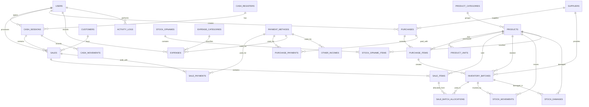

# Telur Jagoan — Rancangan Sistem, Alur, Menu, dan Database

## Override Revisi Produk (2026-08-07)

Gunakan `REVISI.md` sebagai sumber kebenaran terbaru: Penjualan satu menu dengan aksi detail/cetak/pembatalan/retur; Pembelian/Kulakan satu menu dengan supplier inline, pembayaran, biaya tambahan, bukti, dan pengingat jatuh tempo; Produk dan Kategori terpisah; tanpa menu Supplier/Pelanggan; Keuangan tiga area CRUD; Laporan detail/cetak; Pengaturan pengguna/struk/backup; Landing page satu menu dikerjakan terakhir. Semua pembatalan/retur memperbarui stok dan keuangan secara atomik, dan harga/kg bersifat statis.

## 1. Gambaran Umum

**Telur Jagoan** adalah website responsif berbasis **Next.js** untuk membantu operasional toko kecil yang menjual telur.

Sistem terdiri dari dua bagian utama:

1. **Landing page publik** untuk memperkenalkan toko, produk, layanan, alamat, dan kontak.
2. **Dashboard internal** untuk mengelola penjualan, pembelian, stok, supplier, pelanggan, keuangan, hutang supplier, dan laporan.

Sistem hanya memiliki dua jenis pengguna:

- `OWNER`
- `CASHIER`

Owner sekaligus berperan sebagai admin. Sistem **tidak menyediakan piutang atau hutang pelanggan**. Setiap penjualan kepada pelanggan harus dibayar lunas saat transaksi. Hutang hanya berlaku pada pembelian toko kepada supplier atau pemasok.

---

## 2. Tujuan Sistem

Sistem Telur Jagoan dibuat untuk:

- Mempermudah transaksi penjualan.
- Membantu kasir melakukan transaksi dengan cepat.
- Mencetak struk penjualan.
- Mencatat pembelian telur dari supplier.
- Mengelola hutang toko kepada supplier.
- Mengontrol stok telur.
- Mencatat telur rusak, pecah, atau kedaluwarsa.
- Mengelola pemasukan dan pengeluaran.
- Menghitung laba kotor dan laba bersih.
- Menyediakan laporan penjualan, pembelian, stok, dan keuangan.
- Memperkenalkan toko melalui landing page.
- Menyimpan riwayat aktivitas transaksi secara terstruktur.

---

## 3. Teknologi yang Digunakan

| Bagian | Teknologi |
|---|---|
| Framework | Next.js App Router |
| Bahasa | TypeScript |
| Styling | Tailwind CSS |
| Database | PostgreSQL |
| ORM | Prisma ORM |
| Validasi | Zod |
| Autentikasi | NextAuth.js (Auth.js) dengan strategi session/JWT |
| Grafik | Recharts |
| Cetak struk | HTML dan CSS `@media print`, dicetak lewat jendela popup |
| Ekspor Excel | SheetJS (`xlsx`) |
| Ekspor PDF | `@react-pdf/renderer` |
| Deployment | Vercel atau VPS |
| Penyimpanan gambar | Object storage atau cloud storage |

### Database yang Direkomendasikan

Database yang direkomendasikan adalah **PostgreSQL** karena mendukung transaksi database, relasi yang kuat, constraint, dan cocok digunakan bersama Prisma ORM.

Alternatifnya adalah **MySQL** apabila hosting yang tersedia hanya mendukung MySQL.

### Library Ekspor Data

PDF dan Excel adalah format file yang berbeda sehingga tetap memerlukan satu library khusus untuk masing-masing format (tidak ada satu library yang menangani keduanya dengan baik). Library berikut dipilih karena ringan, murni JavaScript/TypeScript (tanpa dependensi biner tambahan), dan berjalan mulus di lingkungan Next.js (termasuk Server Actions/Route Handler):

- **Excel** — `xlsx` (SheetJS). Digunakan untuk menghasilkan file `.xlsx` dari data laporan (tabel penjualan, pembelian, stok, dsb) langsung di server lalu dikirim sebagai file unduhan.
- **PDF** — `@react-pdf/renderer`. Dipilih karena struk dan laporan dapat disusun menggunakan komponen React biasa (mirip JSX), sehingga tampilannya mudah dikustomisasi dan konsisten dengan desain aplikasi, serta ringan dijalankan di sisi server Next.js.

---

## 4. Jenis Pengguna dan Hak Akses

### 4.1 Owner/Admin

Owner memiliki akses penuh untuk:

- Melihat dashboard bisnis.
- Mengelola kasir.
- Melakukan dan melihat seluruh transaksi penjualan.
- Mengelola pembelian.
- Mengelola hutang supplier.
- Mengelola produk dan harga.
- Mengelola stok.
- Mengelola supplier dan pelanggan.
- Mencatat pemasukan dan pengeluaran.
- Melihat laba dan seluruh laporan.
- Mengatur landing page dan identitas toko.
- Mengelola akun kasir.
- Membatalkan transaksi.
- Melakukan stok opname.
- Melihat aktivitas pengguna.

### 4.2 Kasir

Kasir hanya memiliki akses untuk operasional penjualan:

- Login.
- Membuka sesi kasir.
- Memasukkan modal awal.
- Melakukan transaksi penjualan.
- Menerima pembayaran.
- Mencetak dan mencetak ulang struk.
- Melihat transaksi sendiri.
- Menutup sesi kasir.
- Memasukkan jumlah uang fisik saat penutupan kasir.

Kasir tidak dapat:

- Melihat harga modal.
- Melihat laba toko.
- Melihat hutang supplier.
- Mengelola pembelian.
- Mengubah stok secara manual.
- Mengelola produk.
- Mengelola pengguna.
- Mengubah pengaturan toko.
- Melihat seluruh laporan keuangan.

### 4.3 Matriks Hak Akses

| Fitur | Owner/Admin | Kasir |
|---|:---:|:---:|
| Dashboard bisnis | Ya | Tidak |
| Dashboard kasir | Ya | Ya |
| Transaksi penjualan | Ya | Ya |
| Cetak struk | Ya | Ya |
| Cetak ulang struk | Ya | Ya |
| Riwayat seluruh penjualan | Ya | Tidak |
| Riwayat transaksi sendiri | Ya | Ya |
| Melihat harga modal | Ya | Tidak |
| Mengelola produk | Ya | Tidak |
| Supplier internal via pembelian | Ya | Tidak |
| Pelanggan Umum internal | Ya | Otomatis |
| Mengelola pembelian | Ya | Tidak |
| Melihat hutang supplier | Ya | Tidak |
| Mengelola pengeluaran | Ya | Tidak |
| Melihat laba | Ya | Tidak |
| Melakukan stok opname | Ya | Tidak |
| Mengelola kasir | Ya | Tidak |
| Mengatur landing page | Ya | Tidak |
| Pengaturan toko | Ya | Tidak |

---

## 5. Susunan Menu Landing Page

```text
Beranda
Produk
Tentang Kami
Keunggulan
Layanan
Lokasi
Kontak
Login
```

### Beranda

Menampilkan nama toko, slogan, gambar produk, tombol WhatsApp, produk unggulan, keunggulan, dan informasi layanan.

Contoh slogan:

```text
Telur Segar, Harga Bersahabat
```

### Produk

Menampilkan nama produk, jenis telur, foto, satuan penjualan, harga, status stok, dan tombol pesan.

### Tentang Kami

Menampilkan profil toko, cerita singkat Telur Jagoan, visi pelayanan, dan kualitas produk.

### Keunggulan

- Telur segar.
- Supplier terpercaya.
- Harga terjangkau.
- Melayani eceran dan grosir.
- Stok selalu diperbarui.
- Pelayanan cepat.

### Layanan

- Pembelian eceran.
- Pembelian grosir.
- Pesanan melalui WhatsApp.
- Pengantaran jika tersedia.
- Pemesanan untuk warung, rumah makan, dan usaha.

### Lokasi dan Kontak

Menampilkan alamat, jam operasional, Google Maps, WhatsApp, telepon, media sosial, dan email jika tersedia.

---

## 6. Susunan Menu Owner/Admin

```text
Dashboard

Kasir
├── Transaksi Baru
├── Sesi Kasir
└── Riwayat Sesi Kasir

Penjualan
├── Daftar Penjualan
├── Detail Penjualan
├── Cetak Ulang Struk
├── Pembatalan Penjualan
└── Retur Penjualan

Pembelian
├── Pembelian Baru
├── Daftar Pembelian
├── Detail Pembelian
├── Pembayaran Supplier
├── Hutang Supplier
└── Retur Pembelian

Produk dan Stok
├── Data Produk
├── Kategori Produk
├── Satuan Produk
├── Harga Produk
├── Stok Produk
├── Batch Produk
├── Pergerakan Stok
├── Telur Rusak
├── Telur Kedaluwarsa
└── Stok Opname

Keuangan
├── Semua Transaksi Keuangan
├── Pemasukan
└── Pengeluaran

Laporan
├── Laporan Penjualan
├── Laporan Pembelian
├── Laporan Stok
├── Laporan Produk Terlaris
├── Laporan Telur Rusak
├── Laporan Hutang Supplier
├── Laporan Pemasukan
├── Laporan Pengeluaran
├── Laporan Laba Kotor
├── Laporan Laba Bersih
└── Laporan Kasir

Semua halaman laporan bersifat read-only: filter periode/tanggal, tampilkan tabel/detail, lalu cetak PDF atau ekspor Excel. Tidak ada aksi ubah data dari Laporan.

Landing Page
├── Informasi Toko
├── Banner
├── Produk Unggulan
├── Kontak
├── Lokasi
└── Media Sosial

Pengguna
└── Data Kasir
    ├── Tambah kasir
    ├── Edit kasir
    └── Nonaktifkan kasir

Pengaturan
├── Pengaturan Struk
│   ├── Logo toko
│   ├── Nama toko di struk
│   ├── Alamat
│   ├── Nomor telepon/WhatsApp
│   └── Footer struk
└── Backup Data
    ├── Trigger backup manual
    └── Unduh backup terakhir
```

---

## 7. Susunan Menu Kasir

```text
Dashboard Kasir

Kasir
├── Buka Kasir
├── Transaksi Baru
├── Transaksi Hari Ini
├── Cetak Ulang Struk
└── Tutup Kasir

Riwayat Saya
└── Riwayat Transaksi
```

Dashboard kasir menampilkan nama kasir, status sesi, modal awal, total transaksi hari ini, total penjualan, pembayaran per metode, transaksi terakhir, dan tombol transaksi baru.

---

## 8. Alur Umum Sistem

```text
Supplier mengirim telur
        ↓
Owner mencatat pembelian
        ↓
Stok bertambah
        ↓
Jika belum lunas, tercatat sebagai hutang supplier
        ↓
Kasir menjual produk kepada pelanggan
        ↓
Pelanggan membayar lunas
        ↓
Stok berkurang
        ↓
Penjualan dan pembayaran tercatat
        ↓
Struk dicetak
        ↓
Sistem menghitung harga pokok dan laba
        ↓
Owner melihat laporan
```

---

## 9. Alur Login

```text
Pengguna membuka halaman login
        ↓
Memasukkan email atau username
        ↓
Memasukkan password
        ↓
Sistem memverifikasi akun
        ↓
Sistem memeriksa role
        ↓
OWNER diarahkan ke Dashboard Owner
CASHIER diarahkan ke Dashboard Kasir
```

Aturan:

- Akun tidak aktif tidak dapat login.
- Password disimpan dalam bentuk hash.
- Halaman owner tidak boleh dapat diakses oleh kasir.
- Aktivitas login dapat dicatat dalam audit log.

### 9.1 Implementasi Teknis

- Autentikasi dibangun menggunakan **NextAuth.js (Auth.js)** dengan **Credentials Provider** (username/email + password, dicocokkan ke `password_hash` di tabel `users`), karena sistem ini tidak memakai login pihak ketiga (Google/Facebook, dsb).
- Strategi sesi menggunakan **JWT** (`session.strategy = "jwt"`), sehingga status login (role, id user) disimpan terenkripsi di dalam token JWT pada cookie `httpOnly`, tanpa perlu tabel session terpisah di database.
- **Middleware proteksi route** (`middleware.ts` di root project) memeriksa token JWT pada setiap request ke path `/dashboard/**`. Jika token tidak ada/kedaluwarsa, pengguna dialihkan ke halaman login. Middleware juga memeriksa `role` pada token untuk memisahkan akses halaman khusus Owner dari halaman Kasir sebelum halaman sempat dirender.
- **Penanganan refresh token (JWT):** NextAuth.js secara otomatis memperbarui (rotate) JWT melalui callback `jwt()` setiap kali token diakses selama masih dalam masa berlaku `maxAge`. Karena tidak ada idle di tengah masa aktif yang perlu "diperpanjang" secara manual, token cukup dibuat ulang (re-issued) dengan waktu kedaluwarsa baru setiap kali ada aktivitas pengguna (lihat auto-logout di Bagian 10.2) — pendekatan ini disebut *sliding session*.

---

## 10. Keamanan & Autentikasi

Selain alur login dasar, sistem menerapkan lapisan keamanan berikut agar aman digunakan oleh toko sehari-hari.

### 10.1 Rate Limiting Login (Anti Brute Force)

```text
Percobaan login gagal dihitung per akun dan per alamat IP
        ↓
5 kali gagal berturut-turut dalam 15 menit
        ↓
Akun dikunci sementara selama 15 menit
        ↓
Pesan ditampilkan tanpa membocorkan akun mana yang salah
        ↓
Percobaan login dicatat di activity_logs
```

Aturan:

- Pesan error login tidak membedakan antara "username salah" dan "password salah" (cukup "Username atau password salah").
- Penguncian akun tidak menghapus data, hanya menahan sementara.
- Owner dapat membuka kunci akun kasir secara manual dari menu Pengguna jika diperlukan.

### 10.2 Session Expiry / Auto-Logout

- Session login menggunakan cookie `httpOnly` dan `secure` (khusus HTTPS), dikelola oleh NextAuth.js.
- **Auto-logout setelah 20 menit tanpa aktivitas** (idle timeout), berlaku untuk owner maupun kasir. Setiap ada aktivitas (klik, navigasi, request ke server), masa berlaku token diperpanjang otomatis (*sliding session*) sehingga pengguna yang aktif tidak akan ter-logout tiba-tiba di tengah pekerjaan.
- Jika 20 menit berlalu tanpa aktivitas sama sekali, token JWT dianggap kedaluwarsa, middleware akan menolak akses ke halaman dashboard, dan pengguna diarahkan kembali ke halaman login.
- Saat sesi kasir (`cash_sessions`) masih `OPEN` namun kasir ter-auto-logout, sesi kasir **tidak** otomatis ditutup — hanya sesi login yang berakhir. Sesi kasir tetap harus ditutup manual melalui alur Tutup Kasir setelah kasir login kembali.

### 10.3 CSRF Protection untuk Server Actions

- Seluruh Server Actions Next.js menggunakan mekanisme proteksi CSRF bawaan Next.js (origin checking) dan token action yang tervalidasi otomatis.
- Permintaan mutasi data (create, update, delete) hanya diterima dari origin domain toko sendiri.
- Endpoint API yang diekspos ke luar (jika ada, misalnya webhook) menggunakan API key terpisah, bukan session cookie.

### 10.4 Validasi Input di Sisi Server

- Validasi Zod di form (client-side) hanya untuk pengalaman pengguna (feedback cepat), **bukan sumber kebenaran**.
- Setiap Server Action dan Route Handler **wajib** memvalidasi ulang input menggunakan skema Zod yang sama di sisi server sebelum data diproses atau disimpan ke database.
- Validasi server mencakup: tipe data, batas nilai (misalnya jumlah tidak boleh negatif), keberadaan relasi (produk/supplier/pelanggan benar-benar ada), dan hak akses role terhadap aksi yang diminta.
- Pemeriksaan otorisasi (role Owner/Kasir) dilakukan di layer `server/services`, bukan hanya disembunyikan di UI, sehingga kasir tidak bisa memanggil aksi owner meski tahu endpoint-nya.

### 10.5 Praktik Tambahan

- Password disimpan menggunakan hashing (bcrypt/argon2), bukan enkripsi dua arah.
- Semua komunikasi menggunakan HTTPS (termasuk saat deployment ke VPS, wajib pasang SSL/TLS).
- Header keamanan dasar diaktifkan (Content Security Policy, X-Frame-Options, X-Content-Type-Options).

### 10.6 Daftar Validasi Penting (Zod)

Beberapa aturan validasi kunci yang wajib diterapkan baik di client (UX) maupun di server (sumber kebenaran — lihat Bagian 10.4):

| Field | Aturan Validasi |
|---|---|
| Jumlah beli di keranjang kasir | Tidak boleh melebihi stok yang tersedia (`current_stock` produk terkait). Jika jumlah yang diminta lebih besar dari stok, sistem menolak menambah item dengan pesan "Stok tidak mencukupi" dan tidak dapat melanjutkan checkout. |
| Jumlah pada pembelian, retur, opname | Harus lebih besar dari 0 (tidak boleh 0 atau negatif). |
| Nomor telepon (`phone`, `whatsapp` pada `users`, `suppliers`, `customers`, `store_settings`) | Format nomor Indonesia: diawali `08` atau `+62`, hanya berisi angka (boleh diawali `+`), panjang 9–15 digit. Contoh valid: `081234567890`, `+6281234567890`. |
| Email | Format email standar (`z.string().email()`). |
| Harga jual, harga beli, harga per kg | Harus lebih besar dari 0. |
| Konversi satuan (`conversion_to_base`) | Harus lebih besar dari 0. |
| Pembayaran hutang supplier | Jumlah bayar tidak boleh melebihi `remaining_debt` yang tersisa. |
| Split payment kasir | Total seluruh metode pembayaran harus sama persis dengan `grand_total` transaksi. |
| Password | Minimum 8 karakter saat dibuat/diganti. |

---

## 11. Alur Pembelian dari Supplier

```text
Owner membuka menu Pembelian Baru
        ↓
Memilih supplier
        ↓
Mengisi nomor nota supplier
        ↓
Memilih produk dan satuan
        ↓
Mengisi jumlah dan harga beli
        ↓
Mengisi tanggal masuk dan kedaluwarsa
        ↓
Sistem menghitung subtotal
        ↓
Owner mengisi diskon dan biaya tambahan
        ↓
Sistem menghitung total pembelian
        ↓
Owner memilih pembayaran tunai, sebagian, atau tempo
        ↓
Pembelian disimpan
        ↓
Batch stok dibuat
        ↓
Stok bertambah
        ↓
Pergerakan stok masuk dibuat
        ↓
Jika belum lunas, tercatat sebagai hutang supplier
```

Status pembayaran pembelian:

```text
UNPAID  = Belum dibayar
PARTIAL = Dibayar sebagian
PAID    = Lunas
```

Contoh:

```text
Total pembelian : Rp5.000.000
Dibayar         : Rp2.000.000
Sisa hutang     : Rp3.000.000
Jatuh tempo     : 20 Agustus 2026
Status          : PARTIAL
```

---

## 12. Alur Pembayaran Hutang Supplier

```text
Owner membuka menu Hutang Supplier
        ↓
Memilih transaksi pembelian
        ↓
Sistem menampilkan total dan sisa hutang
        ↓
Owner memasukkan jumlah pembayaran
        ↓
Memilih metode pembayaran
        ↓
Menyimpan pembayaran
        ↓
Sistem menghitung ulang sisa hutang
        ↓
Jika sisa hutang = 0, status menjadi PAID
```

Aturan:

- Pembayaran tidak boleh melebihi sisa hutang.
- Setiap pembayaran memiliki nomor bukti.
- Riwayat pembayaran tidak boleh dihapus sembarangan.
- Koreksi pembayaran dilakukan melalui reversal atau pembatalan tercatat.
- Hutang melewati jatuh tempo diberi penanda.

---

## 13. Alur Transaksi Kasir

```text
Kasir login
        ↓
Kasir membuka sesi kasir
        ↓
Memasukkan modal awal
        ↓
Kasir membuka Transaksi Baru
        ↓
Memilih atau mencari produk
        ↓
Memilih satuan dan jumlah
        ↓
Sistem memeriksa stok
        ↓
Produk masuk ke keranjang
        ↓
Sistem menghitung subtotal
        ↓
Kasir memasukkan diskon jika diizinkan
        ↓
Pelanggan melakukan pembayaran
        ↓
Kasir memilih metode pembayaran
        ↓
Sistem memvalidasi pembayaran lunas
        ↓
Transaksi disimpan
        ↓
Stok berkurang
        ↓
Harga pokok penjualan disimpan
        ↓
Pembayaran dicatat
        ↓
Struk dicetak
```

Aturan:

- Penjualan tidak boleh disimpan jika stok tidak mencukupi.
- Penjualan harus dibayar lunas.
- Tidak ada piutang pelanggan.
- Kasir tidak dapat melihat harga beli.
- Pembatalan transaksi membutuhkan hak owner atau alasan tercatat.
- **Tidak ada pembulatan harga.** Total transaksi mengikuti nilai persis hasil perhitungan (harga × jumlah − diskon), tanpa dibulatkan ke kelipatan 50/100.

### 13.1 Void / Hapus Item dari Keranjang

Sebelum transaksi disimpan (checkout), kasir dapat mengubah isi keranjang secara bebas:

```text
Kasir menambahkan produk ke keranjang
        ↓
Item tersimpan sementara di state keranjang (belum masuk database)
        ↓
Kasir dapat mengubah jumlah item
        ↓
Kasir dapat menghapus (void) item tertentu dari keranjang
        ↓
Sistem menghitung ulang subtotal secara otomatis
        ↓
Kasir melanjutkan ke pembayaran, atau
Kasir membatalkan seluruh keranjang (kosongkan keranjang)
```

Catatan: karena keranjang belum tersimpan ke tabel `sales`, void item pada tahap ini **tidak** memerlukan izin owner dan tidak tercatat sebagai pembatalan transaksi. Pembatalan transaksi (butuh izin owner) hanya berlaku untuk transaksi yang **sudah** tersimpan/`COMPLETED`.

### 13.2 Split Payment (Pembayaran Gabungan)

Satu transaksi penjualan dapat dibayar menggunakan lebih dari satu metode pembayaran sekaligus, misalnya sebagian tunai dan sebagian QRIS atau transfer.

```text
Kasir memilih Bayar
        ↓
Kasir memilih metode pembayaran pertama (contoh: CASH)
        ↓
Kasir memasukkan jumlah untuk metode tersebut
        ↓
Sistem menghitung sisa tagihan
        ↓
Jika sisa tagihan > 0, kasir dapat menambah metode pembayaran lain (QRIS atau TRANSFER)
        ↓
Diulang sampai sisa tagihan = 0
        ↓
Setiap metode pembayaran disimpan sebagai baris terpisah di sale_payments
        ↓
Sistem memvalidasi total seluruh sale_payments = grand_total penjualan
```

Contoh:

```text
Total belanja  : Rp150.000
Bayar tunai     : Rp100.000
Bayar QRIS      : Rp50.000
Total dibayar   : Rp150.000 (lunas)
```

Metode pembayaran yang didukung untuk penjualan: **Tunai (CASH)**, **QRIS**, dan **Transfer Bank (TRANSFER)**. Struktur tabel `sale_payments` dan enum `PaymentMethodType` pada rancangan ini sudah mendukung skenario ini tanpa perlu perubahan skema.

### 13.3 Mode Koneksi Internet Terputus (Opsional: Offline-First / PWA)

Kasir menggunakan koneksi data seluler sebagai jalur utama. Namun karena koneksi dapat terputus sewaktu-waktu, sistem **boleh** menyediakan mode offline-first berbasis PWA (Progressive Web App) sebagai fitur opsional/lanjutan, bukan kebutuhan wajib di tahap awal:

```text
Koneksi internet terputus saat kasir bertransaksi
        ↓
(Jika mode PWA offline aktif)
Transaksi tetap dapat dibuat dan disimpan sementara di local storage/IndexedDB perangkat kasir
        ↓
Struk tetap bisa dicetak dari data lokal
        ↓
Saat koneksi kembali tersedia, transaksi otomatis disinkronkan ke server
        ↓
Sistem memvalidasi ulang stok saat sinkronisasi (mencegah stok minus akibat transaksi ganda dari perangkat berbeda)
```

Catatan implementasi:

- Fitur ini **opsional** — hanya dikerjakan apabila cukup mudah diimplementasikan dengan effort yang wajar (Service Worker + IndexedDB + Background Sync API).
- Jika tidak dikerjakan di versi awal, sistem cukup menampilkan notifikasi "Koneksi terputus, transaksi tidak dapat diproses" saat offline, dan kasir menunggu koneksi kembali.
- Ditempatkan sebagai fitur lanjutan pada fase pengembangan (lihat Fase 9 — PWA & Mode Offline).

---

## 14. Alur Buka dan Tutup Kasir

### Buka Kasir

```text
Kasir login
        ↓
Memilih Buka Kasir
        ↓
Memasukkan modal awal
        ↓
Sistem membuat sesi kasir
        ↓
Status sesi menjadi OPEN
        ↓
Kasir dapat melakukan transaksi
```

Aturan:

- Satu kasir hanya boleh memiliki satu sesi aktif.
- Kasir tidak dapat bertransaksi sebelum membuka sesi.
- Modal awal bukan pemasukan penjualan.

### Tutup Kasir

```text
Kasir memilih Tutup Kasir
        ↓
Sistem menghitung uang yang seharusnya
        ↓
Kasir menghitung uang fisik
        ↓
Kasir memasukkan jumlah uang fisik
        ↓
Sistem menghitung selisih
        ↓
Kasir memasukkan catatan jika ada selisih
        ↓
Sesi ditutup dan owner dapat memeriksa
```

Rumus:

```text
Kas Seharusnya =
Modal Awal
+ Penjualan Tunai
+ Kas Masuk
- Kas Keluar
- Pengembalian Tunai
```

```text
Selisih Kas = Kas Fisik - Kas Seharusnya
```

---

## 15. Alur Stok

Stok masuk dapat berasal dari:

- Pembelian supplier.
- Retur penjualan.
- Koreksi stok.
- Hasil stok opname.

Stok keluar dapat berasal dari:

- Penjualan.
- Retur pembelian.
- Produk rusak.
- Produk pecah.
- Produk kedaluwarsa.
- Koreksi stok.
- Hasil stok opname.

Semua perubahan stok wajib dicatat di tabel `stock_movements`.

### Telur Rusak atau Kedaluwarsa

```text
Owner memilih produk dan batch
        ↓
Memasukkan jumlah dan alasan
        ↓
Sistem mengurangi stok
        ↓
Pergerakan stok keluar dibuat
        ↓
Nilai kerugian dihitung dari harga modal
        ↓
Masuk laporan kerugian stok
```

### Stok Opname

```text
Owner membuat stok opname
        ↓
Sistem mengambil stok tercatat
        ↓
Owner menghitung stok fisik
        ↓
Sistem menghitung selisih
        ↓
Owner mengonfirmasi hasil
        ↓
Sistem membuat penyesuaian stok
```

---

## 16. Alur Keuangan dan Laba

Pemasukan dapat berasal dari:

- Penjualan.
- Pemasukan lain-lain.
- Penambahan modal owner.
- Pengembalian dana dari supplier.

Pengeluaran dapat berasal dari:

- Pembayaran supplier.
- Listrik.
- Transportasi.
- Plastik atau kemasan.
- Gaji kasir.
- Perawatan.
- Sewa.
- Pengeluaran lain.

Rumus:

```text
Arus Kas = Kas Masuk - Kas Keluar
```

```text
Laba Kotor = Penjualan Bersih - Harga Pokok Penjualan
```

```text
Laba Bersih = Laba Kotor - Pengeluaran Operasional
```

Pembelian stok tidak langsung dianggap sebagai kerugian seluruhnya karena barang yang belum terjual masih menjadi persediaan.

---

## 17. Sistem Satuan Produk

Semua stok disimpan dalam satuan dasar.

Contoh:

```text
Produk       : Telur Ayam Ras
Satuan dasar : BUTIR
```

| Satuan | Konversi |
|---|---:|
| Butir | 1 |
| Tray | 30 |
| Peti | Sesuai isi sebenarnya |

Contoh penjualan:

```text
2 tray × 30 butir = 60 butir
```

Aturan:

- Setiap produk memiliki satu satuan dasar.
- Harga dapat berbeda untuk tiap satuan.
- Konversi harus lebih dari nol.
- Produk berdasarkan berat menggunakan satuan dasar kilogram.
- Jangan memaksakan konversi kilogram ke butir.

### 17.1 Produk Berdasarkan Berat (Kilogram)

Untuk produk yang dijual per kilogram, harga **sudah ditentukan di awal saat data produk ditambahkan/diedit** oleh owner (harga per kg statis, bukan ditimbang real-time saat transaksi). Kasir tinggal memasukkan jumlah kilogram yang dibeli pelanggan secara manual (input angka, misalnya 1.5 kg), lalu sistem mengalikan dengan harga per kg yang sudah tersimpan di `product_units.selling_price`.

```text
Contoh:
Produk        : Telur Ayam Ras
Satuan        : Kg
Harga per kg  : Rp28.000 (ditentukan owner saat input produk)

Kasir memasukkan jumlah : 1.5 kg
Subtotal                : 1.5 × Rp28.000 = Rp42.000
```

Tidak diperlukan integrasi timbangan digital — jumlah kilogram diinput manual oleh kasir berdasarkan hasil timbangan fisik di toko.

---

## 18. Metode Harga Pokok FIFO

FIFO berarti stok yang masuk lebih dahulu digunakan lebih dahulu.

Contoh:

```text
Batch A: 100 butir × Rp1.600
Batch B: 100 butir × Rp1.700
Penjualan: 120 butir
```

HPP:

```text
100 × Rp1.600 = Rp160.000
20 × Rp1.700  = Rp34.000
Total HPP     = Rp194.000
```

---

## 19. Cetak Struk — Detail Teknis

### 19.1 Ukuran Kertas

- Struk dicetak menggunakan format **thermal 80mm** (standar printer kasir thermal).
- Layout struk (`@media print` / komponen cetak) dirancang dengan lebar tetap 80mm agar rapi di semua printer thermal 80mm.

### 19.2 Dukungan Printer

Sistem mendukung dua jalur pencetakan:

- **Printer thermal USB** — tersambung langsung ke perangkat kasir (laptop/PC/tablet), dicetak melalui dialog print browser atau library thermal printing (contoh: menggunakan Web USB API/ESC-POS command untuk cetak langsung tanpa dialog print, jika diperlukan kecepatan lebih tinggi).
- **Printer thermal Bluetooth** — tersambung ke perangkat kasir (khususnya tablet/HP) melalui Web Bluetooth API, mengirim perintah cetak ESC-POS ke printer.

Kasir dapat memilih/menyimpan printer default (USB atau Bluetooth) di pengaturan perangkat kasirnya, sehingga tidak perlu memilih ulang setiap transaksi.

### 19.3 Struk Digital (Elektronik)

Selain cetak fisik, sistem dapat menyimpan salinan struk secara elektronik:

```text
Transaksi selesai
        ↓
Sistem membuat struk (format cetak + format digital)
        ↓
Struk fisik dicetak ke printer thermal (jika tersedia)
        ↓
Struk digital disimpan sebagai catatan transaksi (dapat dilihat ulang, dicetak ulang, atau dibagikan)
```

- Karena seluruh data transaksi (item, harga, pembayaran) sudah tersimpan lengkap di `sales`, `sale_items`, dan `sale_payments`, struk **selalu bisa dibuat ulang kapan saja** dari data tersebut — tidak wajib menyimpan file gambar/PDF terpisah untuk setiap transaksi.
- Struk digital ditampilkan melalui halaman "Cetak Ulang Struk" dan dapat diunduh sebagai gambar/PDF atau dibagikan (misalnya dikirim manual via WhatsApp) jika dibutuhkan.
- Tabel `sales` ditambahkan kolom berikut untuk mendukung fitur ini:

| Kolom | Tipe | Keterangan |
|---|---|---|
| `print_count` | INTEGER | Jumlah struk sudah dicetak/dicetak ulang |
| `last_printed_at` | TIMESTAMP | Waktu terakhir struk dicetak |

### 19.4 Konten Struk

Struk mencantumkan informasi berikut, disusun dari atas ke bawah:

```text
[Logo Toko]
Nama Toko            (dari store_settings.store_name)
Alamat Toko          (store_settings.address)
No. Telepon/WA       (store_settings.phone / whatsapp)
--------------------------------
No. Transaksi        (sales.sale_number)
Tanggal & Jam         (sales.sale_date)
Kasir                (nama kasir yang login)
--------------------------------
Daftar Item:
  Nama Produk
  Jumlah x Satuan @ Harga Satuan       Subtotal
  (diulang untuk setiap item, termasuk diskon per item jika ada)
--------------------------------
Subtotal
Diskon               (jika ada)
Total
Bayar (per metode)   (contoh: Tunai Rp100.000, QRIS Rp50.000)
Kembalian
--------------------------------
Footer               (store_settings.receipt_footer,
                       contoh: "Terima kasih telah berbelanja di Telur Jagoan")
```

Struk **tidak** menyertakan QR code — cukup teks sesuai susunan di atas.

### 19.5 Mekanisme Cetak (Popup Window)

```text
Kasir menekan tombol "Cetak Struk"
        ↓
Sistem membuka jendela popup baru berisi halaman struk (layout 80mm, CSS @media print)
        ↓
window.print() dipanggil otomatis saat popup terbuka
        ↓
Dialog cetak browser muncul, kasir memilih printer thermal (USB/Bluetooth) yang sudah terpasang di sistem operasi perangkat
        ↓
Popup tertutup otomatis setelah proses cetak selesai/dibatalkan
```

Catatan: pendekatan popup + `window.print()` dipilih karena paling sederhana dan kompatibel di berbagai browser tanpa driver tambahan, selama printer thermal sudah terpasang sebagai printer sistem operasi (baik lewat kabel USB maupun pairing Bluetooth). Untuk kebutuhan cetak yang lebih cepat tanpa dialog print (opsional/lanjutan), dapat dikembangkan lebih lanjut memakai perintah ESC-POS langsung seperti disebutkan di Bagian 19.2.

---

## 20. Susunan Database

### Pengguna dan Toko

```text
users
store_settings
cash_registers
cash_sessions
cash_movements
activity_logs
notifications
```

### Master Data

```text
suppliers
customers
product_categories
products
product_units
payment_methods
```

### Pembelian

```text
purchases
purchase_items
purchase_payments
purchase_returns
purchase_return_items
```

### Penjualan

```text
sales
sale_items
sale_payments
sale_batch_allocations
sale_returns
sale_return_items
```

### Stok

```text
inventory_batches
stock_movements
stock_opnames
stock_opname_items
stock_damages
```

### Keuangan

```text
expense_categories
expenses
other_incomes
```

### Landing Page

```text
landing_banners
landing_features
store_social_media
```

---

## 21. Detail Tabel Database

### 21.1 `users`

| Kolom | Tipe | Keterangan |
|---|---|---|
| `id` | UUID | Primary key |
| `name` | VARCHAR | Nama pengguna |
| `username` | VARCHAR | Username unik |
| `email` | VARCHAR | Email unik |
| `password_hash` | TEXT | Password hash |
| `role` | ENUM | `OWNER` atau `CASHIER` |
| `phone` | VARCHAR | Nomor telepon |
| `is_active` | BOOLEAN | Status akun |
| `last_login_at` | TIMESTAMP | Login terakhir |
| `created_at` | TIMESTAMP | Waktu dibuat |
| `updated_at` | TIMESTAMP | Waktu diperbarui |

### 21.2 `store_settings`

| Kolom | Tipe | Keterangan |
|---|---|---|
| `id` | UUID | Primary key |
| `store_name` | VARCHAR | Nama toko |
| `tagline` | VARCHAR | Slogan |
| `address` | TEXT | Alamat |
| `phone` | VARCHAR | Telepon |
| `whatsapp` | VARCHAR | WhatsApp |
| `email` | VARCHAR | Email |
| `logo_url` | TEXT | URL logo |
| `receipt_footer` | TEXT | Footer struk |
| `tax_percentage` | DECIMAL | Pajak |
| `currency` | VARCHAR | Mata uang |
| `timezone` | VARCHAR | Zona waktu |
| `created_at` | TIMESTAMP | Waktu dibuat |
| `updated_at` | TIMESTAMP | Waktu diperbarui |

### 21.3 `cash_registers`

| Kolom | Tipe | Keterangan |
|---|---|---|
| `id` | UUID | Primary key |
| `code` | VARCHAR | Kode kasir |
| `name` | VARCHAR | Nama perangkat |
| `location` | VARCHAR | Lokasi |
| `is_active` | BOOLEAN | Status |
| `created_at` | TIMESTAMP | Waktu dibuat |
| `updated_at` | TIMESTAMP | Waktu diperbarui |

### 21.4 `cash_sessions`

| Kolom | Tipe | Keterangan |
|---|---|---|
| `id` | UUID | Primary key |
| `session_number` | VARCHAR | Nomor sesi |
| `cash_register_id` | UUID | Relasi perangkat kasir |
| `cashier_id` | UUID | Relasi kasir |
| `opened_at` | TIMESTAMP | Waktu buka |
| `opening_cash` | DECIMAL | Modal awal |
| `closed_at` | TIMESTAMP | Waktu tutup |
| `expected_cash` | DECIMAL | Kas seharusnya |
| `actual_cash` | DECIMAL | Kas fisik |
| `cash_difference` | DECIMAL | Selisih |
| `status` | ENUM | `OPEN`/`CLOSED` |
| `notes` | TEXT | Catatan |
| `created_at` | TIMESTAMP | Waktu dibuat |
| `updated_at` | TIMESTAMP | Waktu diperbarui |

### 21.5 `cash_movements`

| Kolom | Tipe | Keterangan |
|---|---|---|
| `id` | UUID | Primary key |
| `cash_session_id` | UUID | Relasi sesi |
| `movement_type` | ENUM | Jenis pergerakan |
| `amount` | DECIMAL | Jumlah |
| `description` | TEXT | Keterangan |
| `reference_type` | VARCHAR | Jenis referensi |
| `reference_id` | UUID | ID referensi |
| `created_by` | UUID | Pengguna |
| `created_at` | TIMESTAMP | Waktu dibuat |

Jenis pergerakan:

```text
OPENING_CASH
CASH_IN
CASH_OUT
SALE_CASH
REFUND_CASH
CLOSING_ADJUSTMENT
```

### 21.6 `suppliers`

| Kolom | Tipe | Keterangan |
|---|---|---|
| `id` | UUID | Primary key |
| `supplier_code` | VARCHAR | Kode unik |
| `name` | VARCHAR | Nama supplier |
| `contact_person` | VARCHAR | Nama kontak |
| `phone` | VARCHAR | Telepon |
| `email` | VARCHAR | Email |
| `address` | TEXT | Alamat |
| `notes` | TEXT | Catatan |
| `is_active` | BOOLEAN | Status |
| `created_at` | TIMESTAMP | Waktu dibuat |
| `updated_at` | TIMESTAMP | Waktu diperbarui |

### 21.7 `customers`

| Kolom | Tipe | Keterangan |
|---|---|---|
| `id` | UUID | Primary key |
| `customer_code` | VARCHAR | Kode pelanggan |
| `name` | VARCHAR | Nama |
| `phone` | VARCHAR | Telepon |
| `address` | TEXT | Alamat |
| `customer_type` | ENUM | Jenis pelanggan |
| `is_active` | BOOLEAN | Status |
| `created_at` | TIMESTAMP | Waktu dibuat |
| `updated_at` | TIMESTAMP | Waktu diperbarui |

Jenis pelanggan:

```text
GENERAL
RETAIL
WHOLESALE
```

Data default:

```text
Kode  : CUS-0000
Nama  : Pelanggan Umum
Jenis : GENERAL
```

Tidak ada kolom kredit, hutang, cicilan, atau jatuh tempo pelanggan.

### 21.8 `product_categories`

| Kolom | Tipe | Keterangan |
|---|---|---|
| `id` | UUID | Primary key |
| `category_code` | VARCHAR | Kode kategori |
| `name` | VARCHAR | Nama |
| `description` | TEXT | Deskripsi |
| `is_active` | BOOLEAN | Status |
| `created_at` | TIMESTAMP | Waktu dibuat |
| `updated_at` | TIMESTAMP | Waktu diperbarui |

### 21.9 `products`

| Kolom | Tipe | Keterangan |
|---|---|---|
| `id` | UUID | Primary key |
| `product_code` | VARCHAR | Kode produk |
| `barcode` | VARCHAR | Barcode |
| `category_id` | UUID | Relasi kategori |
| `name` | VARCHAR | Nama produk |
| `description` | TEXT | Deskripsi |
| `image_url` | TEXT | Gambar |
| `base_unit_name` | VARCHAR | Satuan dasar |
| `minimum_stock` | DECIMAL | Stok minimum |
| `current_stock` | DECIMAL | Stok saat ini |
| `is_featured` | BOOLEAN | Produk unggulan |
| `is_active` | BOOLEAN | Status |
| `created_at` | TIMESTAMP | Waktu dibuat |
| `updated_at` | TIMESTAMP | Waktu diperbarui |

### 21.10 `product_units`

| Kolom | Tipe | Keterangan |
|---|---|---|
| `id` | UUID | Primary key |
| `product_id` | UUID | Relasi produk |
| `unit_name` | VARCHAR | Nama satuan |
| `conversion_to_base` | DECIMAL | Konversi |
| `selling_price` | DECIMAL | Harga jual |
| `wholesale_price` | DECIMAL | Harga grosir |
| `barcode` | VARCHAR | Barcode satuan |
| `is_base_unit` | BOOLEAN | Satuan dasar |
| `is_active` | BOOLEAN | Status |
| `created_at` | TIMESTAMP | Waktu dibuat |
| `updated_at` | TIMESTAMP | Waktu diperbarui |

### 21.11 `payment_methods`

| Kolom | Tipe | Keterangan |
|---|---|---|
| `id` | UUID | Primary key |
| `code` | VARCHAR | Kode |
| `name` | VARCHAR | Nama metode |
| `type` | ENUM | Jenis pembayaran |
| `is_active` | BOOLEAN | Status |
| `created_at` | TIMESTAMP | Waktu dibuat |
| `updated_at` | TIMESTAMP | Waktu diperbarui |

Jenis:

```text
CASH
QRIS
TRANSFER
DEBIT_CARD
OTHER
```

### 21.12 `purchases`

| Kolom | Tipe | Keterangan |
|---|---|---|
| `id` | UUID | Primary key |
| `purchase_number` | VARCHAR | Nomor pembelian |
| `supplier_id` | UUID | Relasi supplier |
| `supplier_invoice_number` | VARCHAR | Nota supplier |
| `purchase_date` | DATE | Tanggal pembelian |
| `due_date` | DATE | Jatuh tempo |
| `subtotal` | DECIMAL | Subtotal |
| `discount_amount` | DECIMAL | Diskon |
| `shipping_cost` | DECIMAL | Ongkir |
| `other_cost` | DECIMAL | Biaya lain |
| `grand_total` | DECIMAL | Total |
| `amount_paid` | DECIMAL | Total dibayar |
| `remaining_debt` | DECIMAL | Sisa hutang |
| `payment_status` | ENUM | Status pembayaran |
| `status` | ENUM | Status pembelian |
| `notes` | TEXT | Catatan |
| `created_by` | UUID | Owner pembuat |
| `created_at` | TIMESTAMP | Waktu dibuat |
| `updated_at` | TIMESTAMP | Waktu diperbarui |

### 21.13 `purchase_items`

| Kolom | Tipe | Keterangan |
|---|---|---|
| `id` | UUID | Primary key |
| `purchase_id` | UUID | Relasi pembelian |
| `product_id` | UUID | Produk |
| `product_unit_id` | UUID | Satuan |
| `quantity` | DECIMAL | Jumlah satuan |
| `conversion_to_base` | DECIMAL | Konversi |
| `base_quantity` | DECIMAL | Jumlah dasar |
| `unit_cost` | DECIMAL | Harga per satuan |
| `base_unit_cost` | DECIMAL | Modal satuan dasar |
| `discount_amount` | DECIMAL | Diskon |
| `subtotal` | DECIMAL | Subtotal |
| `expiry_date` | DATE | Kedaluwarsa |
| `created_at` | TIMESTAMP | Waktu dibuat |

### 21.14 `purchase_payments`

| Kolom | Tipe | Keterangan |
|---|---|---|
| `id` | UUID | Primary key |
| `payment_number` | VARCHAR | Nomor pembayaran |
| `purchase_id` | UUID | Relasi pembelian |
| `payment_method_id` | UUID | Metode |
| `payment_date` | DATE | Tanggal |
| `amount` | DECIMAL | Jumlah |
| `reference_number` | VARCHAR | Nomor referensi |
| `notes` | TEXT | Catatan |
| `created_by` | UUID | Owner |
| `created_at` | TIMESTAMP | Waktu dibuat |

### 21.15 `inventory_batches`

| Kolom | Tipe | Keterangan |
|---|---|---|
| `id` | UUID | Primary key |
| `batch_number` | VARCHAR | Nomor batch |
| `product_id` | UUID | Produk |
| `purchase_item_id` | UUID | Asal pembelian |
| `supplier_id` | UUID | Supplier |
| `received_date` | DATE | Tanggal diterima |
| `expiry_date` | DATE | Kedaluwarsa |
| `initial_quantity` | DECIMAL | Jumlah awal |
| `remaining_quantity` | DECIMAL | Sisa stok |
| `base_unit_cost` | DECIMAL | Harga modal |
| `status` | ENUM | Status batch |
| `created_at` | TIMESTAMP | Waktu dibuat |
| `updated_at` | TIMESTAMP | Waktu diperbarui |

### 21.16 `sales`

| Kolom | Tipe | Keterangan |
|---|---|---|
| `id` | UUID | Primary key |
| `sale_number` | VARCHAR | Nomor penjualan |
| `sale_date` | TIMESTAMP | Tanggal transaksi |
| `customer_id` | UUID | Pelanggan |
| `cashier_id` | UUID | Kasir |
| `cash_session_id` | UUID | Sesi kasir |
| `subtotal` | DECIMAL | Subtotal |
| `discount_amount` | DECIMAL | Diskon |
| `tax_amount` | DECIMAL | Pajak |
| `grand_total` | DECIMAL | Total |
| `amount_paid` | DECIMAL | Dibayar |
| `change_amount` | DECIMAL | Kembalian |
| `total_cost` | DECIMAL | Total HPP |
| `gross_profit` | DECIMAL | Laba kotor |
| `status` | ENUM | Status transaksi |
| `print_count` | INTEGER | Jumlah struk dicetak/dicetak ulang |
| `last_printed_at` | TIMESTAMP | Waktu terakhir struk dicetak |
| `notes` | TEXT | Catatan |
| `created_at` | TIMESTAMP | Waktu dibuat |
| `updated_at` | TIMESTAMP | Waktu diperbarui |

Status:

```text
COMPLETED
CANCELLED
REFUNDED
```

### 21.17 `sale_items`

| Kolom | Tipe | Keterangan |
|---|---|---|
| `id` | UUID | Primary key |
| `sale_id` | UUID | Relasi penjualan |
| `product_id` | UUID | Produk |
| `product_unit_id` | UUID | Satuan |
| `product_name_snapshot` | VARCHAR | Nama saat transaksi |
| `unit_name_snapshot` | VARCHAR | Satuan saat transaksi |
| `quantity` | DECIMAL | Jumlah |
| `conversion_to_base` | DECIMAL | Konversi |
| `base_quantity` | DECIMAL | Jumlah dasar |
| `unit_price` | DECIMAL | Harga jual |
| `discount_amount` | DECIMAL | Diskon |
| `subtotal` | DECIMAL | Subtotal |
| `cost_amount` | DECIMAL | HPP item |
| `profit_amount` | DECIMAL | Laba item |
| `created_at` | TIMESTAMP | Waktu dibuat |

### 21.18 `sale_payments`

| Kolom | Tipe | Keterangan |
|---|---|---|
| `id` | UUID | Primary key |
| `sale_id` | UUID | Relasi penjualan |
| `payment_method_id` | UUID | Metode pembayaran |
| `amount` | DECIMAL | Jumlah |
| `reference_number` | VARCHAR | Nomor referensi |
| `paid_at` | TIMESTAMP | Waktu bayar |
| `created_by` | UUID | Pengguna |
| `created_at` | TIMESTAMP | Waktu dibuat |

### 21.19 `sale_batch_allocations`

| Kolom | Tipe | Keterangan |
|---|---|---|
| `id` | UUID | Primary key |
| `sale_item_id` | UUID | Item penjualan |
| `inventory_batch_id` | UUID | Batch |
| `quantity` | DECIMAL | Jumlah diambil |
| `unit_cost` | DECIMAL | Harga modal |
| `total_cost` | DECIMAL | Total HPP |
| `created_at` | TIMESTAMP | Waktu dibuat |

### 21.20 `stock_movements`

| Kolom | Tipe | Keterangan |
|---|---|---|
| `id` | UUID | Primary key |
| `movement_number` | VARCHAR | Nomor pergerakan |
| `product_id` | UUID | Produk |
| `inventory_batch_id` | UUID | Batch |
| `movement_type` | ENUM | Jenis pergerakan |
| `quantity_in` | DECIMAL | Stok masuk |
| `quantity_out` | DECIMAL | Stok keluar |
| `stock_before` | DECIMAL | Stok sebelum |
| `stock_after` | DECIMAL | Stok sesudah |
| `reference_type` | VARCHAR | Jenis sumber |
| `reference_id` | UUID | ID sumber |
| `description` | TEXT | Keterangan |
| `created_by` | UUID | Pengguna |
| `created_at` | TIMESTAMP | Waktu dibuat |

Jenis:

```text
PURCHASE
SALE
SALE_RETURN
PURCHASE_RETURN
DAMAGE
EXPIRED
OPNAME_IN
OPNAME_OUT
ADJUSTMENT_IN
ADJUSTMENT_OUT
```

### 21.21 `stock_damages`

| Kolom | Tipe | Keterangan |
|---|---|---|
| `id` | UUID | Primary key |
| `damage_number` | VARCHAR | Nomor kerusakan |
| `product_id` | UUID | Produk |
| `inventory_batch_id` | UUID | Batch |
| `damage_date` | DATE | Tanggal |
| `damage_type` | ENUM | Jenis kerusakan |
| `quantity` | DECIMAL | Jumlah |
| `unit_cost` | DECIMAL | Harga modal |
| `loss_amount` | DECIMAL | Kerugian |
| `notes` | TEXT | Catatan |
| `created_by` | UUID | Owner |
| `created_at` | TIMESTAMP | Waktu dibuat |

Jenis:

```text
BROKEN
ROTTEN
EXPIRED
LOST
OTHER
```

### 21.22 `stock_opnames`

| Kolom | Tipe | Keterangan |
|---|---|---|
| `id` | UUID | Primary key |
| `opname_number` | VARCHAR | Nomor opname |
| `opname_date` | DATE | Tanggal |
| `status` | ENUM | Status |
| `notes` | TEXT | Catatan |
| `created_by` | UUID | Owner |
| `completed_at` | TIMESTAMP | Waktu selesai |
| `created_at` | TIMESTAMP | Waktu dibuat |
| `updated_at` | TIMESTAMP | Waktu diperbarui |

### 21.23 `stock_opname_items`

| Kolom | Tipe | Keterangan |
|---|---|---|
| `id` | UUID | Primary key |
| `stock_opname_id` | UUID | Relasi opname |
| `product_id` | UUID | Produk |
| `system_quantity` | DECIMAL | Stok sistem |
| `physical_quantity` | DECIMAL | Stok fisik |
| `difference_quantity` | DECIMAL | Selisih |
| `unit_cost` | DECIMAL | Harga modal |
| `difference_value` | DECIMAL | Nilai selisih |
| `notes` | TEXT | Catatan |
| `created_at` | TIMESTAMP | Waktu dibuat |

### 21.24 `expense_categories`

| Kolom | Tipe | Keterangan |
|---|---|---|
| `id` | UUID | Primary key |
| `code` | VARCHAR | Kode |
| `name` | VARCHAR | Nama kategori |
| `description` | TEXT | Deskripsi |
| `is_active` | BOOLEAN | Status |
| `created_at` | TIMESTAMP | Waktu dibuat |
| `updated_at` | TIMESTAMP | Waktu diperbarui |

### 21.25 `expenses`

| Kolom | Tipe | Keterangan |
|---|---|---|
| `id` | UUID | Primary key |
| `expense_number` | VARCHAR | Nomor pengeluaran |
| `expense_category_id` | UUID | Kategori |
| `expense_date` | DATE | Tanggal |
| `amount` | DECIMAL | Jumlah |
| `payment_method_id` | UUID | Metode |
| `description` | TEXT | Keterangan |
| `receipt_url` | TEXT | Bukti |
| `created_by` | UUID | Owner |
| `created_at` | TIMESTAMP | Waktu dibuat |
| `updated_at` | TIMESTAMP | Waktu diperbarui |

### 21.26 `other_incomes`

| Kolom | Tipe | Keterangan |
|---|---|---|
| `id` | UUID | Primary key |
| `income_number` | VARCHAR | Nomor pemasukan |
| `income_date` | DATE | Tanggal |
| `income_type` | VARCHAR | Jenis |
| `amount` | DECIMAL | Jumlah |
| `payment_method_id` | UUID | Metode |
| `description` | TEXT | Keterangan |
| `created_by` | UUID | Owner |
| `created_at` | TIMESTAMP | Waktu dibuat |

### 21.27 `activity_logs`

| Kolom | Tipe | Keterangan |
|---|---|---|
| `id` | UUID | Primary key |
| `user_id` | UUID | Pengguna |
| `action` | VARCHAR | Aksi |
| `entity_type` | VARCHAR | Jenis data |
| `entity_id` | UUID | ID data |
| `old_values` | JSON | Data lama |
| `new_values` | JSON | Data baru |
| `ip_address` | VARCHAR | IP |
| `user_agent` | TEXT | Perangkat |
| `created_at` | TIMESTAMP | Waktu dibuat |

### 21.28 `purchase_returns`

Retur barang ke supplier (misalnya telur pecah/rusak saat diterima, atau salah kirim).

| Kolom | Tipe | Keterangan |
|---|---|---|
| `id` | UUID | Primary key |
| `return_number` | VARCHAR | Nomor retur |
| `purchase_id` | UUID | Relasi pembelian asal |
| `supplier_id` | UUID | Relasi supplier |
| `return_date` | DATE | Tanggal retur |
| `reason` | ENUM | Alasan retur |
| `total_amount` | DECIMAL | Total nilai retur |
| `refund_method` | ENUM | Cara pengembalian dana |
| `status` | ENUM | Status retur |
| `notes` | TEXT | Catatan |
| `created_by` | UUID | Owner pembuat |
| `created_at` | TIMESTAMP | Waktu dibuat |
| `updated_at` | TIMESTAMP | Waktu diperbarui |

Alasan retur:

```text
DAMAGED
WRONG_ITEM
EXPIRED
OTHER
```

Cara pengembalian dana:

```text
CASH_REFUND
DEDUCT_FROM_DEBT
SUPPLIER_CREDIT
```

Status:

```text
DRAFT
COMPLETED
CANCELLED
```

Efek retur pembelian ke sistem:

- Stok pada batch terkait dikurangi (pergerakan stok `PURCHASE_RETURN`).
- Jika pembelian asal masih berstatus `UNPAID`/`PARTIAL`, `remaining_debt` pada `purchases` dapat dikurangi sejumlah nilai retur (opsi `DEDUCT_FROM_DEBT`).
- Jika pembelian sudah lunas, dana dikembalikan tunai (`CASH_REFUND`) dan tercatat sebagai pemasukan lain, atau dijadikan kredit untuk pembelian berikutnya (`SUPPLIER_CREDIT`).

### 21.29 `purchase_return_items`

| Kolom | Tipe | Keterangan |
|---|---|---|
| `id` | UUID | Primary key |
| `purchase_return_id` | UUID | Relasi retur pembelian |
| `purchase_item_id` | UUID | Item pembelian asal |
| `inventory_batch_id` | UUID | Batch terkait |
| `product_id` | UUID | Produk |
| `quantity` | DECIMAL | Jumlah diretur (satuan dasar) |
| `unit_cost` | DECIMAL | Harga modal saat pembelian |
| `subtotal` | DECIMAL | Total nilai item retur |
| `created_at` | TIMESTAMP | Waktu dibuat |

### 21.30 `sale_returns`

Retur dari pelanggan (jarang terjadi untuk produk telur karena sifatnya cepat rusak, namun tetap disediakan untuk kasus salah jual/kemasan rusak sesaat setelah dibeli).

| Kolom | Tipe | Keterangan |
|---|---|---|
| `id` | UUID | Primary key |
| `return_number` | VARCHAR | Nomor retur |
| `sale_id` | UUID | Relasi penjualan asal |
| `return_date` | DATE | Tanggal retur |
| `reason` | ENUM | Alasan retur |
| `total_amount` | DECIMAL | Total nilai retur |
| `refund_method` | ENUM | Cara pengembalian dana ke pelanggan |
| `status` | ENUM | Status retur |
| `approved_by` | UUID | Owner yang menyetujui |
| `notes` | TEXT | Catatan |
| `created_by` | UUID | Kasir/Owner pembuat |
| `created_at` | TIMESTAMP | Waktu dibuat |
| `updated_at` | TIMESTAMP | Waktu diperbarui |

Alasan retur:

```text
DAMAGED
WRONG_ITEM
CUSTOMER_CHANGED_MIND
OTHER
```

Cara pengembalian dana:

```text
CASH_REFUND
```

Status:

```text
DRAFT
COMPLETED
CANCELLED
```

Aturan:

- Retur penjualan **wajib disetujui owner** (`approved_by` terisi) karena berpengaruh langsung terhadap kas dan laba yang sudah tercatat.
- Retur hanya dapat dilakukan terhadap transaksi berstatus `COMPLETED` dan dalam rentang waktu wajar (disarankan maksimal di hari yang sama, mengingat sifat telur).
- Dana dikembalikan tunai langsung ke pelanggan (tidak ada metode lain karena tidak ada akun pelanggan tersimpan).

### 21.31 `sale_return_items`

| Kolom | Tipe | Keterangan |
|---|---|---|
| `id` | UUID | Primary key |
| `sale_return_id` | UUID | Relasi retur penjualan |
| `sale_item_id` | UUID | Item penjualan asal |
| `product_id` | UUID | Produk |
| `quantity` | DECIMAL | Jumlah diretur (satuan dasar) |
| `unit_price` | DECIMAL | Harga jual saat transaksi |
| `subtotal` | DECIMAL | Total nilai item retur |
| `created_at` | TIMESTAMP | Waktu dibuat |

Efek retur penjualan ke sistem:

- Stok produk bertambah kembali (pergerakan stok `SALE_RETURN`), dikembalikan ke batch asal jika masih ada, atau batch baru bertanda "retur" jika batch asal sudah habis.
- Kas berkurang sejumlah `total_amount` (dicatat sebagai `cash_movements` bertipe `REFUND_CASH`).
- Laba kotor pada laporan disesuaikan (dikurangi laba dari item yang diretur).

### 21.32 `landing_banners`

Banner/slider yang tampil di beranda landing page.

| Kolom | Tipe | Keterangan |
|---|---|---|
| `id` | UUID | Primary key |
| `title` | VARCHAR | Judul banner |
| `subtitle` | VARCHAR | Sub-judul/deskripsi singkat |
| `image_url` | TEXT | Gambar banner |
| `link_url` | TEXT | Tautan tujuan saat banner diklik (opsional) |
| `display_order` | INTEGER | Urutan tampil |
| `is_active` | BOOLEAN | Status tampil/tidak |
| `created_at` | TIMESTAMP | Waktu dibuat |
| `updated_at` | TIMESTAMP | Waktu diperbarui |

### 21.33 `landing_features`

Poin keunggulan toko yang ditampilkan di landing page (contoh: "Telur Segar Setiap Hari", "Gratis Ongkir Area Tertentu", "Harga Bersaing").

| Kolom | Tipe | Keterangan |
|---|---|---|
| `id` | UUID | Primary key |
| `icon` | VARCHAR | Nama/kode ikon |
| `title` | VARCHAR | Judul keunggulan |
| `description` | TEXT | Deskripsi singkat |
| `display_order` | INTEGER | Urutan tampil |
| `is_active` | BOOLEAN | Status tampil/tidak |
| `created_at` | TIMESTAMP | Waktu dibuat |
| `updated_at` | TIMESTAMP | Waktu diperbarui |

### 21.34 `store_social_media`

Tautan sosial media/kontak toko yang tampil di landing page (footer/header).

| Kolom | Tipe | Keterangan |
|---|---|---|
| `id` | UUID | Primary key |
| `platform` | ENUM | Jenis platform |
| `label` | VARCHAR | Nama tampilan (opsional) |
| `url_or_number` | VARCHAR | URL profil atau nomor (untuk WhatsApp/telepon) |
| `icon` | VARCHAR | Nama/kode ikon |
| `display_order` | INTEGER | Urutan tampil |
| `is_active` | BOOLEAN | Status tampil/tidak |
| `created_at` | TIMESTAMP | Waktu dibuat |
| `updated_at` | TIMESTAMP | Waktu diperbarui |

Jenis platform:

```text
WHATSAPP
INSTAGRAM
FACEBOOK
TIKTOK
PHONE
EMAIL
OTHER
```

### 21.35 Alur Pengelolaan Konten Landing Page dari Admin

Owner mengelola konten landing page melalui form CRUD biasa di dashboard (bukan drag-and-drop visual builder), agar sederhana dan cepat dibangun:

```text
Owner membuka menu Pengaturan → Landing Page
        ↓
Memilih sub-menu: Banner / Keunggulan / Sosial Media / Profil Toko
        ↓
Menampilkan daftar data yang sudah ada (dapat diurutkan lewat kolom "Urutan Tampil")
        ↓
Owner menambah/mengedit/menghapus data lewat form standar (input teks, upload gambar, toggle aktif/nonaktif)
        ↓
Perubahan tersimpan dan langsung tercermin di landing page publik
```

- Gambar banner diunggah dan diproses melalui pipeline optimasi gambar yang sama seperti gambar produk (lihat Bagian 34.3).
- Data profil toko umum (nama, alamat, telepon, deskripsi, jam operasional) memakai tabel `store_settings` yang sudah ada, bukan tabel terpisah.

### 21.36 `notifications`

Menyimpan notifikasi yang tampil di ikon lonceng headbar (detail alur lihat Bagian 28.1).

| Kolom | Tipe | Keterangan |
|---|---|---|
| `id` | UUID | Primary key |
| `user_id` | UUID | Penerima notifikasi (NULL berarti untuk semua Owner) |
| `type` | ENUM | Jenis notifikasi (`NotificationType`) |
| `title` | VARCHAR | Judul singkat |
| `message` | TEXT | Isi pesan |
| `reference_type` | VARCHAR | Jenis data terkait |
| `reference_id` | UUID | ID data terkait |
| `is_read` | BOOLEAN | Status sudah dibaca |
| `created_at` | TIMESTAMP | Waktu dibuat |

---

## 22. Tabel yang Tidak Diperlukan

Karena tidak ada hutang pelanggan, tabel berikut tidak dibuat:

```text
customer_debts
customer_debt_payments
accounts_receivable
receivable_payments
customer_credit_limits
customer_installments
```

---

## 23. Relasi Utama

```text
users
├── cash_sessions
├── sales
├── purchases
├── expenses
└── activity_logs

suppliers
├── purchases
└── inventory_batches

customers
└── sales

product_categories
└── products

products
├── product_units
├── purchase_items
├── sale_items
├── inventory_batches
├── stock_movements
├── stock_damages
└── stock_opname_items

purchases
├── purchase_items
└── purchase_payments

purchase_items
└── inventory_batches

sales
├── sale_items
└── sale_payments

sale_items
└── sale_batch_allocations

inventory_batches
├── sale_batch_allocations
├── stock_movements
└── stock_damages

cash_registers
└── cash_sessions

cash_sessions
├── sales
└── cash_movements
```

---

## 24. ERD Mermaid



---

## 25. Enum yang Digunakan

```text
UserRole:
OWNER
CASHIER

CustomerType:
GENERAL
RETAIL
WHOLESALE

CashSessionStatus:
OPEN
CLOSED

PurchasePaymentStatus:
UNPAID
PARTIAL
PAID

PurchaseStatus:
DRAFT
RECEIVED
CANCELLED
RETURNED

SaleStatus:
COMPLETED
CANCELLED
REFUNDED

BatchStatus:
ACTIVE
DEPLETED
EXPIRED
BLOCKED

StockOpnameStatus:
DRAFT
COMPLETED
CANCELLED

PaymentMethodType:
CASH
QRIS
TRANSFER
DEBIT_CARD
OTHER

ReturnReason (Pembelian):
DAMAGED
WRONG_ITEM
EXPIRED
OTHER

ReturnReason (Penjualan):
DAMAGED
WRONG_ITEM
CUSTOMER_CHANGED_MIND
OTHER

RefundMethod (Pembelian):
CASH_REFUND
DEDUCT_FROM_DEBT
SUPPLIER_CREDIT

RefundMethod (Penjualan):
CASH_REFUND

ReturnStatus:
DRAFT
COMPLETED
CANCELLED

NotificationType:
LOW_STOCK
OUT_OF_STOCK
BATCH_NEAR_EXPIRY
SUPPLIER_DEBT_DUE
CASH_DIFFERENCE
RETURN_PENDING_APPROVAL

SocialMediaPlatform:
WHATSAPP
INSTAGRAM
FACEBOOK
TIKTOK
PHONE
EMAIL
OTHER
```

---

## 26. Format Nomor Otomatis

```text
Penjualan           : TJ-SAL-20260805-0001
Pembelian           : TJ-PUR-20260805-0001
Pembayaran supplier : TJ-PAY-20260805-0001
Pengeluaran         : TJ-EXP-20260805-0001
Pemasukan lain      : TJ-INC-20260805-0001
Stok opname         : TJ-SOP-20260805-0001
Pergerakan stok     : TJ-STK-20260805-0001
Kerusakan stok      : TJ-DMG-20260805-0001
Batch               : TJ-BAT-20260805-0001
Retur pembelian     : TJ-PRT-20260805-0001
Retur penjualan     : TJ-SRT-20260805-0001
Supplier            : SUP-0001
Pelanggan           : CUS-0001
Kasir               : USR-0001
```

Nomor harus unik, tidak boleh digunakan ulang, dan pembatalan transaksi tidak menghapus nomor.

---

## 27. Aturan Bisnis Utama

1. Sistem hanya memiliki role `OWNER` dan `CASHIER`.
2. Owner sekaligus berperan sebagai admin.
3. Pelanggan tidak dapat berhutang.
4. Penjualan harus dibayar lunas.
5. Hutang hanya berasal dari pembelian ke supplier.
6. Kasir tidak dapat melihat harga modal dan laba.
7. Semua perubahan stok harus memiliki stock movement.
8. Penjualan harus mengurangi stok.
9. Pembatalan penjualan harus mengembalikan stok.
10. Pembelian yang diterima harus menambah stok.
11. Retur pembelian harus mengurangi stok.
12. Telur rusak harus mengurangi stok.
13. Harga pokok disimpan saat transaksi terjadi.
14. Harga lama pada transaksi tidak berubah ketika harga produk diperbarui.
15. Penjualan, pembayaran, alokasi batch, dan pengurangan stok disimpan dalam satu database transaction.
16. Pembayaran hutang supplier tidak boleh melebihi sisa hutang.
17. Satu kasir hanya boleh memiliki satu sesi aktif.
18. Kasir tidak dapat bertransaksi tanpa sesi aktif.
19. Penghapusan transaksi keuangan diganti dengan pembatalan atau reversal.
20. Transaksi selesai harus memiliki jejak audit.
21. Semua nilai uang menggunakan tipe `DECIMAL`, bukan `FLOAT`.
22. Stok tidak boleh negatif.
23. Owner menerima peringatan jika stok di bawah minimum.

---

## 28. Dashboard Owner

Dashboard owner menampilkan:

- Penjualan hari ini.
- Jumlah transaksi.
- Laba kotor.
- Pengeluaran.
- Estimasi laba bersih.
- Pembelian hari ini.
- Total hutang supplier.
- Hutang jatuh tempo.
- Produk hampir habis.
- Produk habis.
- Batch mendekati kedaluwarsa.
- Telur rusak.
- Sesi kasir aktif.
- Selisih kas.
- Grafik penjualan.
- Grafik laba.
- Produk terlaris.
- Metode pembayaran paling sering digunakan.

### 28.1 Notifikasi di Headbar

Sistem menyediakan ikon lonceng notifikasi pada headbar dashboard (tampil untuk Owner; Kasir hanya menerima notifikasi yang relevan dengannya, misalnya sesi kasirnya sendiri):

```text
Ikon lonceng di headbar menampilkan badge jumlah notifikasi belum dibaca
        ↓
Owner/Kasir mengklik ikon lonceng
        ↓
Dropdown/panel notifikasi terbuka menampilkan daftar notifikasi terbaru (terurut dari yang terbaru)
        ↓
Mengklik salah satu notifikasi mengarahkan ke halaman terkait (contoh: notifikasi stok habis → halaman Produk)
        ↓
Notifikasi ditandai sudah dibaca setelah diklik, atau tersedia tombol "Tandai semua sudah dibaca"
```

Jenis notifikasi dan pemicunya:

| Jenis Notifikasi | Pemicu |
|---|---|
| Stok hampir habis | `current_stock` produk ≤ `minimum_stock` |
| Stok habis | `current_stock` produk = 0 |
| Batch mendekati kedaluwarsa | Batch dengan `expiry_date` dalam 3 hari ke depan |
| **Hutang supplier jatuh tempo** | Muncul otomatis **1 minggu sebelum** `due_date` pembelian yang belum lunas (`UNPAID`/`PARTIAL`), dan tetap muncul (ditandai mendesak) jika sudah melewati jatuh tempo |
| Selisih kas saat tutup kasir | `cash_difference` pada sesi kasir tidak sama dengan 0 |
| Retur menunggu persetujuan | Ada `sale_returns` berstatus `DRAFT` yang menunggu persetujuan owner |

Notifikasi disimpan di tabel `notifications` berikut agar riwayatnya tetap ada dan status "sudah dibaca" dapat dilacak per pengguna:

| Kolom | Tipe | Keterangan |
|---|---|---|
| `id` | UUID | Primary key |
| `user_id` | UUID | Penerima notifikasi (NULL berarti untuk semua Owner) |
| `type` | ENUM | Jenis notifikasi (sesuai tabel di atas) |
| `title` | VARCHAR | Judul singkat |
| `message` | TEXT | Isi pesan |
| `reference_type` | VARCHAR | Jenis data terkait |
| `reference_id` | UUID | ID data terkait |
| `is_read` | BOOLEAN | Status sudah dibaca |
| `created_at` | TIMESTAMP | Waktu dibuat |

Notifikasi jenis stok, batch kedaluwarsa, dan hutang jatuh tempo dihasilkan oleh proses terjadwal (cron job/scheduled task) yang berjalan otomatis setiap hari, memeriksa kondisi di atas dan membuat baris `notifications` baru bila kondisi terpenuhi (menghindari duplikasi notifikasi untuk kondisi yang sama pada hari yang sama).

---

## 29. Dashboard Kasir

Dashboard kasir menampilkan:

- Nama kasir.
- Status sesi.
- Modal awal.
- Penjualan hari ini.
- Jumlah transaksi.
- Pembayaran tunai.
- Pembayaran QRIS.
- Pembayaran transfer.
- Transaksi terakhir.
- Tombol Transaksi Baru.
- Tombol Cetak Ulang Struk.
- Tombol Tutup Kasir.

Kasir tidak melihat harga modal, HPP, laba, hutang supplier, pengeluaran toko, atau nilai persediaan.

---

## 30. Struktur Folder Next.js

```text
src/
├── app/
│   ├── (public)/
│   │   ├── page.tsx
│   │   ├── produk/
│   │   ├── tentang/
│   │   ├── layanan/
│   │   ├── lokasi/
│   │   └── kontak/
│   │
│   ├── (auth)/
│   │   └── login/
│   │
│   ├── (owner)/
│   │   ├── dashboard/
│   │   ├── kasir/
│   │   ├── penjualan/
│   │   ├── pembelian/
│   │   ├── produk/
│   │   ├── stok/
│   │   ├── supplier/
│   │   ├── pelanggan/
│   │   ├── keuangan/
│   │   ├── laporan/
│   │   ├── landing-page/
│   │   ├── pengguna/
│   │   └── pengaturan/
│   │
│   ├── (cashier)/
│   │   ├── kasir/
│   │   └── riwayat/
│   │
│   └── api/
│
├── components/
│   ├── ui/
│   ├── layout/
│   ├── landing/
│   ├── cashier/
│   ├── product/
│   ├── purchase/
│   ├── stock/
│   ├── finance/
│   └── reports/
│
├── lib/
│   ├── db.ts
│   ├── auth.ts
│   ├── permissions.ts
│   ├── currency.ts
│   ├── transaction-number.ts
│   ├── receipt.ts
│   └── stock.ts
│
├── server/
│   ├── services/
│   ├── repositories/
│   ├── actions/
│   └── validations/
│
├── types/
│
└── prisma/
    ├── schema.prisma
    └── seed.ts
```

---

## 31. Prioritas Pengembangan

### Fase 1 — Fondasi

- Setup Next.js, TypeScript, Tailwind CSS, PostgreSQL, dan Prisma.
- Konfigurasi environment variables (`.env.development`, `.env.production`) dan `.gitignore`.
- Login dengan hashing password, session cookie, dan rate limiting percobaan login.
- Role owner dan kasir.
- Proteksi halaman (route protection) dan otorisasi di layer server.
- Layout dashboard.

### Fase 2 — Master Data

- Produk.
- Kategori.
- Satuan dan harga jual.
- Supplier.
- Pelanggan.
- Metode pembayaran.

### Fase 3 — Pembelian dan Stok

- Pembelian.
- Batch stok.
- Hutang supplier.
- Pembayaran supplier.
- Pergerakan stok.

### Fase 4 — Kasir

- Buka sesi.
- POS.
- Keranjang (termasuk void/hapus item sebelum checkout).
- Pembayaran, termasuk split payment (tunai, QRIS, transfer).
- Pengurangan stok FIFO.
- Cetak struk thermal 80mm (USB dan Bluetooth) serta struk digital.
- Tutup sesi.

### Fase 5 — Keuangan

- Pengeluaran.
- Pemasukan lain.
- Saldo kas.
- Rekonsiliasi kasir.
- Laba kotor dan laba bersih.

### Fase 6 — Persediaan Lanjutan

- Stok opname.
- Telur rusak dan kedaluwarsa.
- Retur pembelian dan penjualan.
- Peringatan stok.

### Fase 7 — Laporan

- Penjualan.
- Pembelian.
- Stok.
- Hutang supplier.
- Pengeluaran.
- Laba.
- Kasir.
- Produk terlaris.
- Ekspor PDF dan Excel.

### Fase 8 — Landing Page

- Beranda.
- Produk.
- Profil toko.
- Kontak.
- Lokasi.
- Tombol WhatsApp.
- SEO dasar (metadata, sitemap, robots.txt, data terstruktur).
- Optimasi gambar produk (`next/image`, kompresi otomatis).

### Fase 9 — Pengujian, Keamanan Lanjutan, dan Deployment

- Unit test untuk perhitungan kritikal (HPP FIFO, konversi satuan, kas, laba).
- Integration test untuk alur penjualan, pembelian, dan pembatalan transaksi.
- Setup backup database otomatis harian dan pengujian proses restore.
- Setup CI/CD sederhana (build & test otomatis sebelum deploy).
- Deployment ke server produksi (Vercel atau VPS) dengan HTTPS aktif.

### Fase 10 — Mode Offline / PWA (Opsional)

- Dikerjakan hanya jika waktu dan kompleksitas memungkinkan.
- Service worker untuk cache aset statis.
- Penyimpanan transaksi sementara di perangkat kasir saat koneksi terputus.
- Sinkronisasi otomatis ke server saat koneksi kembali tersedia.

---

## 32. Minimum Viable Product

Versi pertama cukup memiliki:

- Login owner dan kasir.
- Data produk dan satuan.
- Supplier.
- Pelanggan umum.
- Pembelian.
- Hutang supplier.
- Pembayaran hutang.
- Stok.
- Buka dan tutup kasir.
- Transaksi penjualan.
- Pembayaran lunas.
- Cetak struk.
- Pengeluaran.
- Dashboard sederhana.
- Laporan penjualan.
- Laporan stok.
- Laporan laba sederhana.
- Landing page.

Fitur lanjutan yang dapat ditunda:

- Retur.
- Multi-cabang.
- Pesanan online.
- Pengantaran.
- Loyalitas pelanggan.
- Integrasi printer Bluetooth.
- Integrasi pembayaran langsung.
- Notifikasi WhatsApp otomatis.

---

## 33. Testing & Strategi Deployment

### 33.1 Rencana Unit Test & Integration Test

Pengujian difokuskan pada bagian yang paling berisiko terhadap kesalahan data (stok dan uang), bukan menguji semua hal secara berlebihan.

**Unit test** (fungsi murni, cepat dijalankan):

- Perhitungan HPP FIFO (`lib/stock.ts`).
- Konversi satuan (butir ↔ tray ↔ kg sesuai jenis produk).
- Perhitungan subtotal, diskon, dan grand total.
- Perhitungan selisih kas saat tutup kasir.
- Perhitungan laba kotor dan laba bersih.
- Generator nomor transaksi otomatis (format dan keunikan).

**Integration test** (melibatkan database, memakai database test/testcontainer):

- Alur transaksi penjualan lengkap: stok berkurang, batch teralokasi FIFO, pembayaran tersimpan, laba tersimpan.
- Alur pembelian: stok bertambah, batch baru terbentuk, hutang supplier tercatat benar.
- Alur split payment: total sale_payments harus sama dengan grand_total.
- Alur pembatalan transaksi: stok harus kembali seperti semula.
- Proteksi akses: kasir tidak bisa memanggil aksi khusus owner (harga modal, laba, hutang supplier, dsb).
- Validasi stok tidak boleh negatif dan tidak boleh melebihi sisa hutang saat pembayaran supplier.

**Tools yang disarankan:** Vitest atau Jest untuk unit test, Vitest + Prisma Test Environment (atau database Postgres sementara via Docker) untuk integration test. Testing dilakukan bertahap mengikuti fase pengembangan (Fase 4 Kasir dan Fase 3 Pembelian adalah prioritas tertinggi untuk ditulis testnya lebih dulu karena berkaitan langsung dengan uang dan stok).

### 33.2 Strategi Backup Database Otomatis & Disaster Recovery

- **Backup otomatis harian** (misalnya jam 02.00 dini hari) menggunakan `pg_dump` terjadwal (cron job di VPS, atau fitur backup bawaan penyedia database terkelola bila memakai Vercel Postgres/Supabase/Neon, dsb).
- Backup disimpan minimal 7 hari ke belakang (rolling backup), disimpan di lokasi terpisah dari server utama (object storage seperti S3-compatible storage) agar tetap aman bila server utama bermasalah.
- Menu **Backup Data** pada Pengaturan memungkinkan owner memicu backup manual kapan saja (misalnya sebelum melakukan perubahan besar) dan mengunduh salinan backup terbaru.
- **Rencana pemulihan (disaster recovery):** jika terjadi kegagalan server/database, restore dilakukan dari backup harian terakhir menggunakan `pg_restore`. Data yang hilang paling banyak adalah transaksi dalam satu hari terakhir sejak backup, sehingga disarankan backup lebih sering (contoh setiap 6 jam) jika volume transaksi toko tinggi.
- Untuk aplikasi (kode program), digunakan version control (Git) sehingga kode dapat di-deploy ulang kapan saja tanpa kehilangan riwayat.

### 33.3 Environment Variables & Konfigurasi

Aplikasi menggunakan file environment terpisah untuk tiap tahap:

```text
.env.development   → digunakan saat development lokal
.env.staging        → digunakan di lingkungan staging/uji coba (opsional)
.env.production      → digunakan di server produksi
```

Contoh variabel yang dibutuhkan (nilai aktual dirahasiakan, tidak disimpan di Git):

```text
DATABASE_URL=
SESSION_SECRET=
NEXT_PUBLIC_APP_URL=
STORAGE_BUCKET_URL=
STORAGE_ACCESS_KEY=
STORAGE_SECRET_KEY=
NODE_ENV=
```

Aturan:

- File `.env*` (kecuali `.env.example`) wajib masuk `.gitignore` dan tidak boleh ter-commit ke repository.
- Environment production menggunakan secret yang berbeda dari development (khususnya `SESSION_SECRET` dan kredensial database).
- Konfigurasi disimpan di secret manager platform deployment (Vercel Environment Variables, atau file `.env` yang dijaga aksesnya di VPS).

---

## 34. Aspek Non-Fungsional

### 34.1 SEO Landing Page

- Setiap halaman publik (`Beranda`, `Produk`, `Tentang Kami`, `Layanan`, `Lokasi`, `Kontak`) memiliki metadata unik menggunakan Next.js Metadata API (`title`, `description`, Open Graph image).
- `sitemap.xml` dan `robots.txt` dibuat otomatis menggunakan fitur bawaan Next.js App Router (`app/sitemap.ts` dan `app/robots.ts`) agar terindeks mesin pencari.
- Menggunakan data terstruktur (JSON-LD schema.org tipe `LocalBusiness`/`Store`) pada landing page agar toko lebih mudah muncul di pencarian lokal (misalnya Google Maps/pencarian "jual telur dekat sini").
- URL landing page menggunakan slug yang bersih dan deskriptif (contoh: `/produk`, `/tentang-kami`).

### 34.2 Accessibility (a11y) Dasar

- Kontras warna teks dan latar memenuhi standar WCAG AA minimum agar tetap terbaca.
- Semua gambar produk dan elemen visual memiliki atribut `alt` yang deskriptif.
- Navigasi dan tombol dapat diakses menggunakan keyboard (fokus terlihat jelas), khususnya penting untuk form transaksi kasir yang sering diisi cepat.
- Elemen form (label, input) menggunakan pasangan `label`–`input` yang benar agar ramah pembaca layar (screen reader).

### 34.3 Optimasi Gambar Produk

Gambar produk harus terlihat bagus namun tetap cepat diakses (tidak membebani loading, khususnya bagi pengguna landing page dengan koneksi seluler):

- Menggunakan komponen `next/image` yang otomatis melakukan resize, kompresi, lazy-loading, dan penyajian format modern (WebP/AVIF) sesuai perangkat pengguna.
- Gambar produk diunggah dalam resolusi wajar (disarankan maksimal ~1600px sisi terpanjang) lalu dikompresi otomatis oleh sistem sebelum disimpan ke object storage — tidak menyimpan file asli berukuran sangat besar apa adanya.
- Ditetapkan ukuran maksimum file unggahan (contoh 5MB per gambar) agar proses upload tetap cepat, dengan validasi tipe file (JPG/PNG/WebP saja).
- Placeholder blur (`next/image` blur placeholder) digunakan agar gambar terasa cepat muncul walau sedang dimuat.

### 34.4 Catatan Landing Page

Konten dan desain final landing page (teks, gambar, tampilan) akan disesuaikan belakangan menggunakan file/template yang akan diberikan terpisah dalam framework Next.js yang sudah disiapkan — struktur menu dan kebutuhan data pada Bagian 5 tetap menjadi acuan.

### 34.5 Responsif di Berbagai Perangkat

Seluruh halaman (landing page maupun dashboard) dibangun mobile-first menggunakan breakpoint standar Tailwind CSS, sehingga dapat digunakan dengan baik di HP, tablet, laptop, maupun komputer desktop:

| Breakpoint | Lebar Layar | Perangkat Umum |
|---|---|---|
| Default (tanpa prefix) | < 640px | HP (potret) |
| `sm:` | ≥ 640px | HP (lanskap), HP besar |
| `md:` | ≥ 768px | Tablet (potret) |
| `lg:` | ≥ 1024px | Tablet (lanskap), laptop kecil |
| `xl:` | ≥ 1280px | Laptop/desktop |
| `2xl:` | ≥ 1536px | Monitor besar |

**Perilaku halaman POS (kasir) di tiap perangkat:**

- **HP (< 768px):** Tampilan satu kolom bertumpuk — daftar produk di atas, keranjang belanja dapat dibuka sebagai panel/drawer yang muncul dari bawah agar layar tetap efisien meski sempit.
- **Tablet (768px–1023px):** Tampilan dua kolom berdampingan — daftar/pencarian produk di kiri, keranjang dan pembayaran di kanan (mendekati pengalaman kasir fisik), karena tablet adalah perangkat yang paling umum dipakai untuk kasir toko kecil.
- **Laptop/Desktop (≥ 1024px):** Tampilan dua atau tiga kolom lebih lega — daftar produk (dengan grid gambar), keranjang, dan ringkasan pembayaran ditampilkan sekaligus tanpa perlu berpindah panel, memaksimalkan layar yang lebih luas.

Elemen interaktif (tombol, input jumlah, pilihan satuan) dibuat cukup besar untuk disentuh (target sentuh minimal ±44px) agar nyaman dipakai di layar sentuh HP/tablet, sekaligus tetap nyaman dipakai dengan mouse/keyboard di desktop.

---

## 35. Legalitas Ringan

Sistem ini **tidak menyediakan** halaman kebijakan privasi atau syarat & ketentuan formal. Untuk toko kecil seperti Telur Jagoan, hal ini tidak wajib dan dapat ditambahkan belakangan apabila suatu saat dibutuhkan (misalnya jika toko berkembang dan mulai menyimpan data pelanggan dalam skala besar atau bermitra dengan pihak ketiga).

---

## 36. Kesimpulan

Rancangan final Telur Jagoan menggunakan Next.js, TypeScript, Tailwind CSS, PostgreSQL, dan Prisma, dengan autentikasi NextAuth.js (JWT, auto-logout 20 menit, middleware proteksi route) dan lapisan keamanan tambahan (rate limiting login, CSRF protection, validasi server). Sistem hanya memiliki Owner/Admin dan Kasir. Tidak ada hutang pelanggan; seluruh penjualan wajib dibayar lunas tanpa pembulatan harga, dan dapat dibayar dengan satu atau beberapa metode sekaligus (tunai, QRIS, transfer). Hutang hanya digunakan untuk pembelian toko kepada supplier, dengan notifikasi otomatis 1 minggu sebelum jatuh tempo. Stok disimpan dalam satuan dasar (termasuk harga per kg yang ditentukan di awal), harga pokok dihitung dengan FIFO, dan semua perubahan stok — termasuk retur pembelian dan retur penjualan — harus memiliki jejak pergerakan. Struk dicetak dalam format thermal 80mm (mendukung USB dan Bluetooth) serta tersimpan sebagai struk digital yang dapat dicetak ulang. Sistem dilengkapi rencana pengujian (unit/integration test), backup otomatis dengan strategi disaster recovery, serta memperhatikan aspek non-fungsional seperti SEO, accessibility, optimasi gambar, dan tampilan responsif di HP, tablet, maupun desktop. Sistem dikembangkan bertahap mulai dari login, master data, pembelian, stok, kasir, keuangan, laporan, landing page, hingga pengujian dan deployment, dengan mode offline/PWA sebagai fitur opsional di tahap akhir.
